# Laboratorio 2 - Terraform y Docker

## Datos generales

- **Curso:** Fundamentos de Programación en la Nube
- **Estudiante:** Oscar Marín Zamora
- **Tema:** Infraestructura como código con Terraform y Docker
- **Fecha:** 3 de junio de 2026
- **Estado:** En proceso, pendiente de destrucción de infraestructura y verificación final

## Objetivo

Implementar una infraestructura local con contenedores Docker utilizando Terraform como herramienta de infraestructura como código. Durante el laboratorio se creó una red personalizada, se descargó la imagen oficial de Nginx, se desplegaron tres contenedores, se verificó el acceso desde el navegador, se probó la comunicación interna entre servicios y se revisó cómo Terraform detecta cambios entre lo que existe actualmente y lo que está definido en la configuración.

La infraestructura como código, también conocida como IaC, consiste en definir recursos de infraestructura mediante archivos de configuración. En lugar de crear cada recurso de forma manual, se describe lo que se necesita en un archivo, en este caso `main.tf`, y Terraform se encarga de aplicar esa configuración. Esta forma de trabajo permite repetir despliegues, documentar mejor los cambios y mantener la infraestructura junto con el resto del proyecto.

## Parte 1 - Verificación del entorno

Primero se verificó que Docker y Terraform estuvieran instalados y funcionando correctamente en el equipo. Esta revisión era necesaria porque Terraform utiliza Docker para crear la red, descargar la imagen y administrar los contenedores del laboratorio.

Comandos utilizados:

```powershell
docker --version
```

```powershell
terraform version
```

```powershell
docker ps
```

Evidencias:

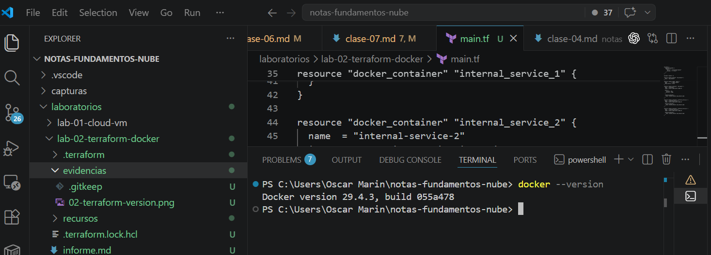

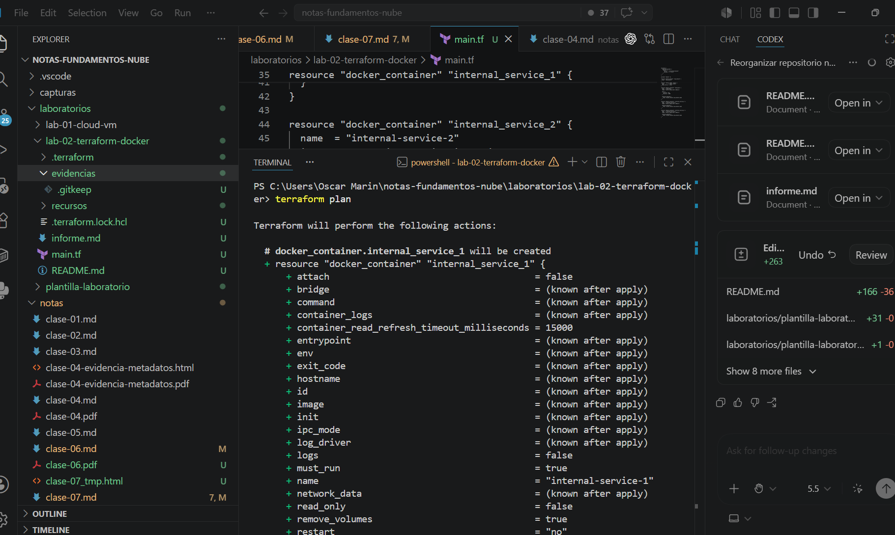

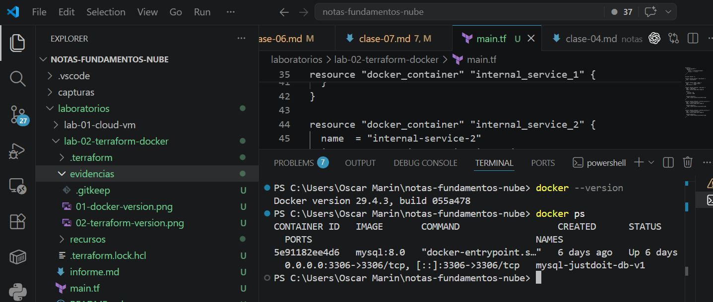

Resultado:

- Docker v29.4.3 se encontró instalado y operativo.
- Terraform v1.15.4 se encontró instalado y operativo.
- Se verificó el estado inicial de los contenedores antes del despliegue.

## Parte 2 - Creación del proyecto

Se creó el proyecto del laboratorio dentro de `laboratorios/lab-02-terraform-docker/`. El archivo principal fue `main.tf`, donde se definieron el proveedor de Docker, la red personalizada, la imagen oficial de Nginx y los tres contenedores utilizados en la práctica.

Comandos utilizados para ubicarse en el proyecto:

```powershell
cd laboratorios/lab-02-terraform-docker
```

Comando utilizado para revisar el archivo principal del laboratorio:

```powershell
Get-Content main.tf
```

En Terraform, un proveedor, o Provider, es el componente que permite trabajar con una plataforma específica. En este laboratorio se utilizó el Provider `kreuzwerker/docker`, que permite que Terraform se comunique con Docker. Gracias a este componente, Terraform puede crear redes, descargar imágenes y administrar contenedores a partir de la configuración escrita en `main.tf`.

Configuración utilizada en `main.tf`:

```hcl
terraform {
  required_providers {
    docker = {
      source  = "kreuzwerker/docker"
      version = "~> 3.0.2"
    }
  }
}

provider "docker" {}

resource "docker_network" "lab_network" {
  name = "lab_network"
}

resource "docker_image" "nginx" {
  name         = "nginx:latest"
  keep_locally = false
}

resource "docker_container" "web_nginx" {
  name  = "web-nginx"
  image = docker_image.nginx.image_id

  ports {
    internal = 80
    external = 9090
  }

  networks_advanced {
    name = docker_network.lab_network.name
  }
}

resource "docker_container" "internal_service_1" {
  name  = "internal-service-1"
  image = docker_image.nginx.image_id

  networks_advanced {
    name = docker_network.lab_network.name
  }
}

resource "docker_container" "internal_service_2" {
  name  = "internal-service-2"
  image = docker_image.nginx.image_id

  networks_advanced {
    name = docker_network.lab_network.name
  }
}
```

Evidencia:

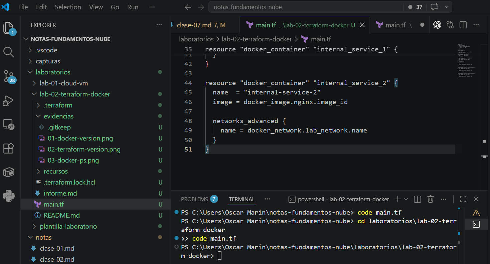

La red personalizada `lab_network` se usó para mantener los contenedores del laboratorio dentro de una misma red Docker. Esto permite que los servicios se comuniquen entre sí usando sus nombres de contenedor, sin depender de direcciones IP fijas.

## Parte 3 - Inicialización y despliegue

Después de crear `main.tf`, se inicializó el proyecto con Terraform. Al ejecutar este comando, Terraform descargó el Provider necesario y preparó el directorio de trabajo.

Comando utilizado:

```powershell
terraform init
```

Evidencia:

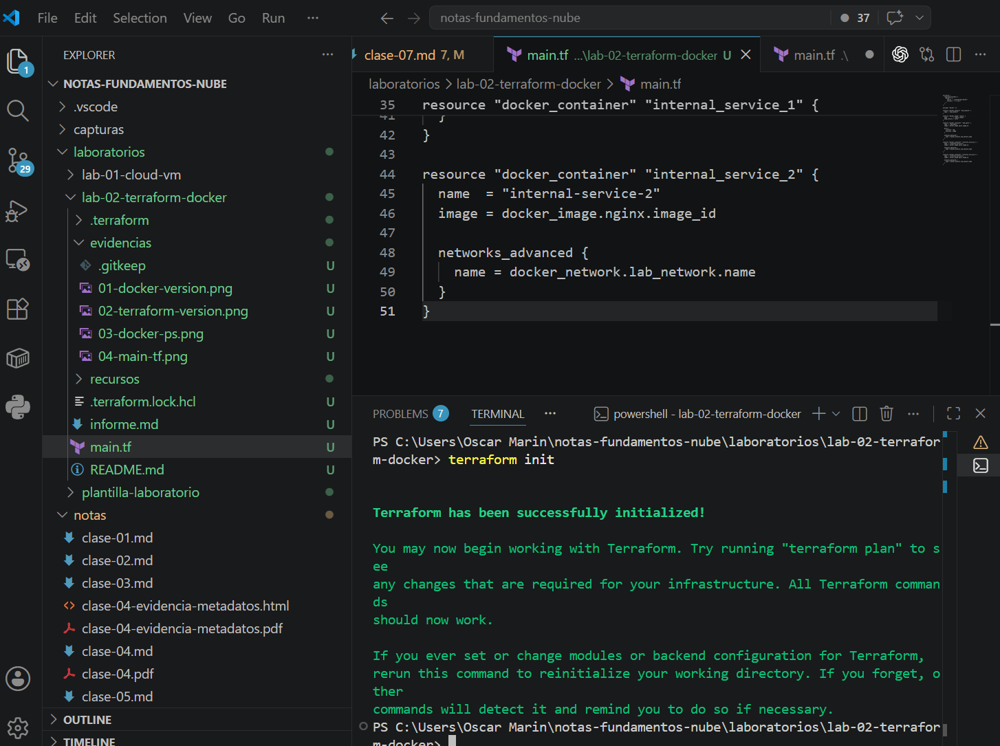

Luego se validó la sintaxis de la configuración:

```powershell
terraform validate
```

Evidencia:

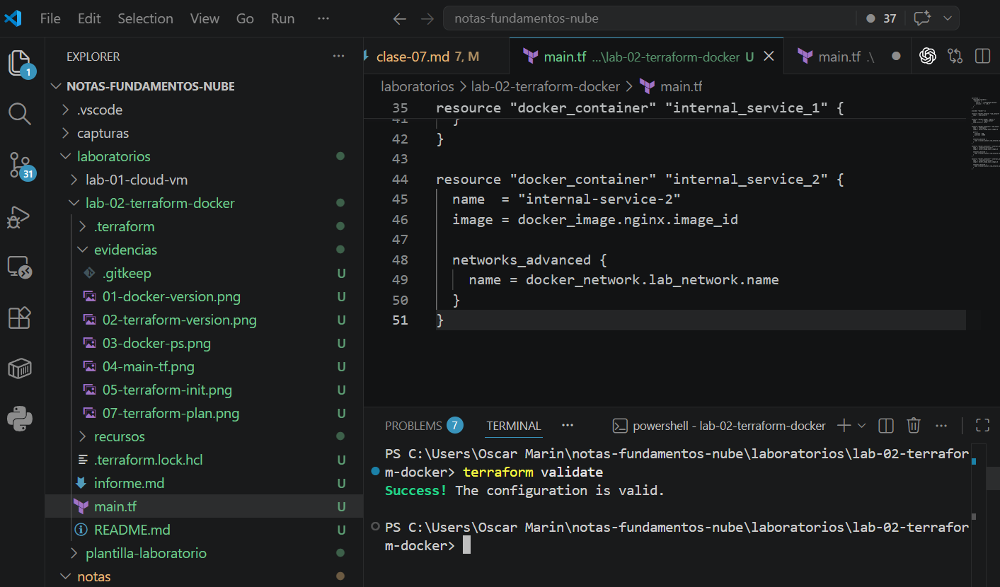

Posteriormente se revisó el plan de ejecución antes de crear los recursos:

```powershell
terraform plan
```

Evidencia:

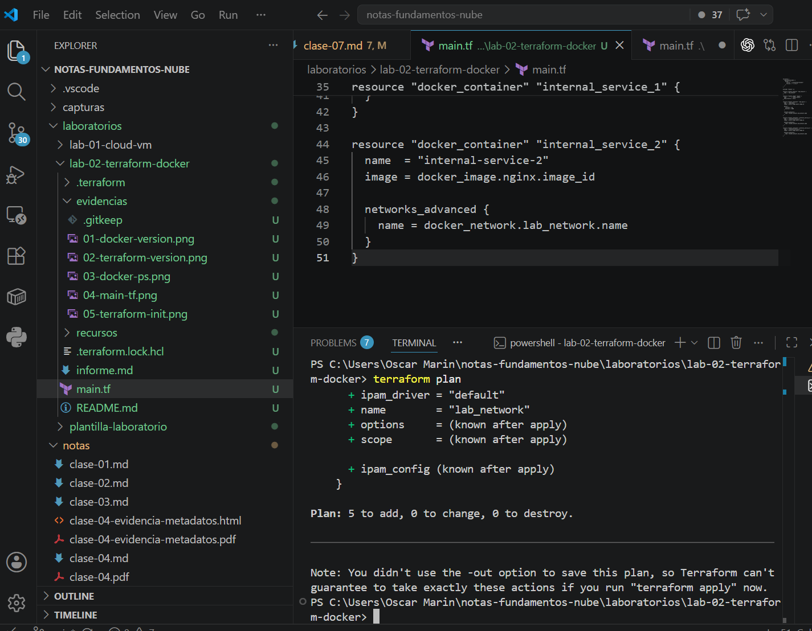

Finalmente se aplicó la configuración:

```powershell
terraform apply
```

Evidencia:

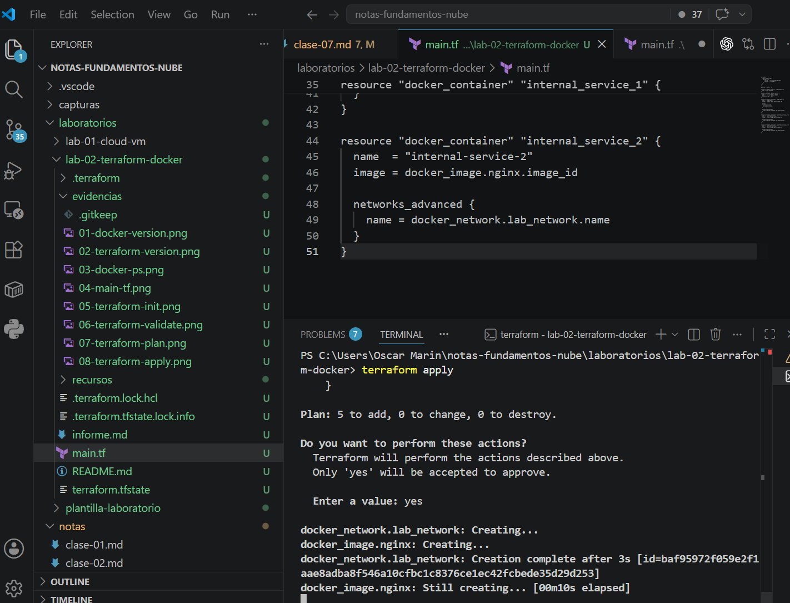

Como resultado, Terraform creó la red `lab_network`, descargó la imagen oficial `nginx:latest` y creó los contenedores `web-nginx`, `internal-service-1` e `internal-service-2`.

El archivo `terraform.tfstate` es el archivo donde Terraform guarda el estado de los recursos que administra. En este laboratorio registra los recursos creados, sus atributos principales y la relación entre lo definido en `main.tf` y lo que existe realmente en Docker. Este archivo es importante porque Terraform lo utiliza para saber qué recursos ya existen y qué cambios debe aplicar en futuras ejecuciones.

## Parte 4 - Verificación del despliegue

Una vez aplicado el despliegue, se verificó que los contenedores estuvieran en ejecución.

Comandos utilizados:

```powershell
docker ps
```

```powershell
docker ps -a
```

Evidencia:

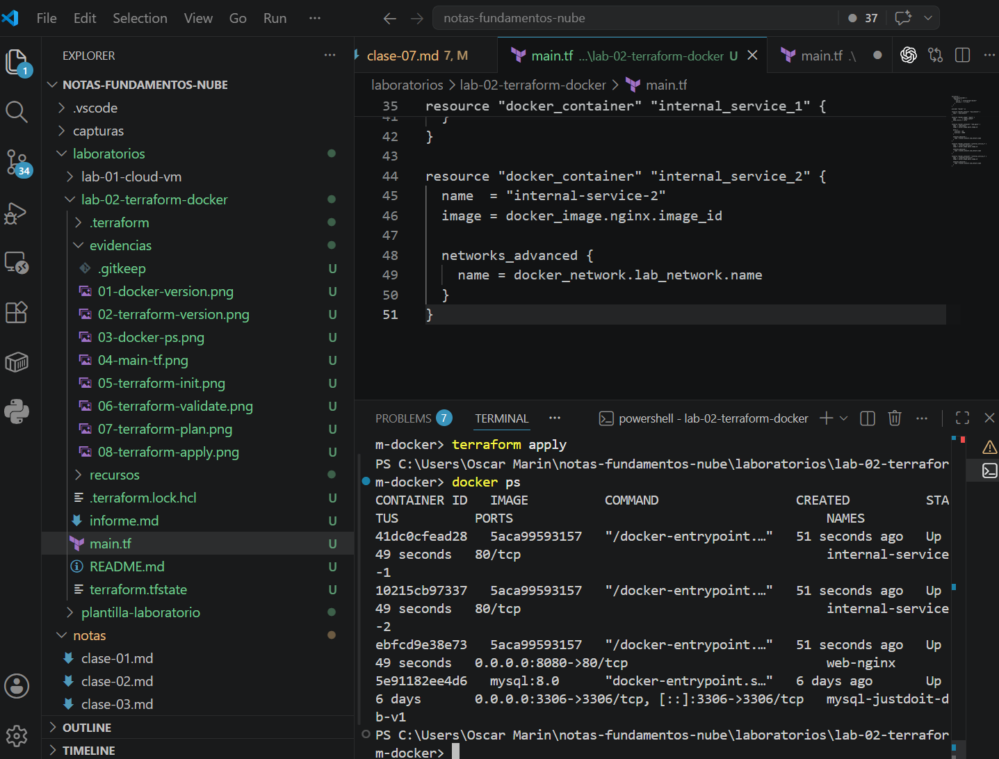

También se verificó el acceso al servidor Nginx desde el navegador. Inicialmente el contenedor `web-nginx` fue expuesto usando el puerto externo `8080`, por lo que el acceso se realizó desde:

```text
http://localhost:8080
```

Evidencia:

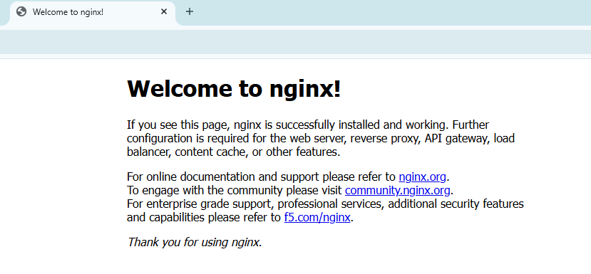

Esta prueba permitió confirmar que el puerto publicado en el equipo local redirigía correctamente hacia el puerto interno `80` del contenedor.

## Parte 5 - Comunicación interna entre contenedores

En esta etapa se verificó que los contenedores pudieran comunicarse dentro de `lab_network`. Para la prueba se ejecutó `curl` desde un contenedor hacia otros servicios, usando el nombre del contenedor como dirección.

Comandos utilizados:

```powershell
docker exec -it internal-service-1 curl http://web-nginx
```

```powershell
docker exec -it internal-service-1 curl http://internal-service-2
```

Evidencia:

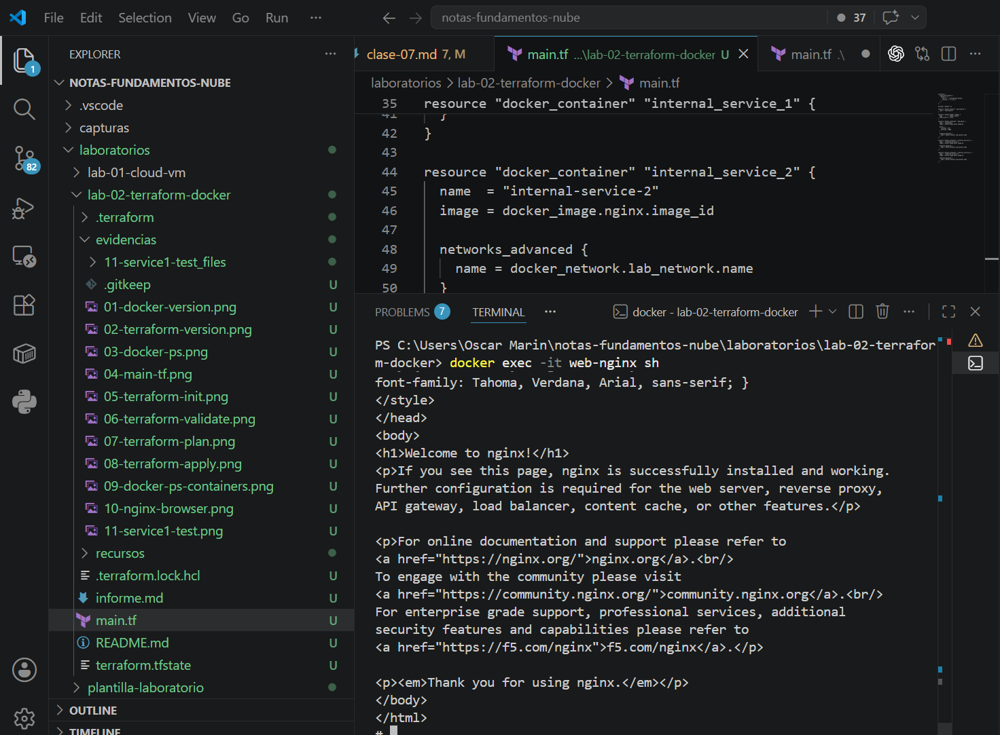

Los contenedores pueden comunicarse sin utilizar IP porque Docker incluye resolución interna de nombres en las redes personalizadas. Cuando varios contenedores están conectados a la misma red, cada nombre de contenedor puede funcionar como un nombre de host. Esto es útil porque las direcciones IP internas pueden cambiar si un contenedor se elimina y se vuelve a crear.

Docker resuelve estos nombres mediante su DNS interno. En una red personalizada, Docker mantiene el registro de los contenedores conectados y permite que una solicitud a `web-nginx` se dirija hacia la dirección interna actual de ese contenedor. Por eso `internal-service-1` pudo comunicarse con `web-nginx` e `internal-service-2` usando nombres, sin conocer sus direcciones IP.

## Parte 6 - Inspección de red

Se inspeccionó la red `lab_network` para revisar su configuración y confirmar qué contenedores estaban conectados.

Comando utilizado:

```powershell
docker network inspect lab_network
```

Evidencia:

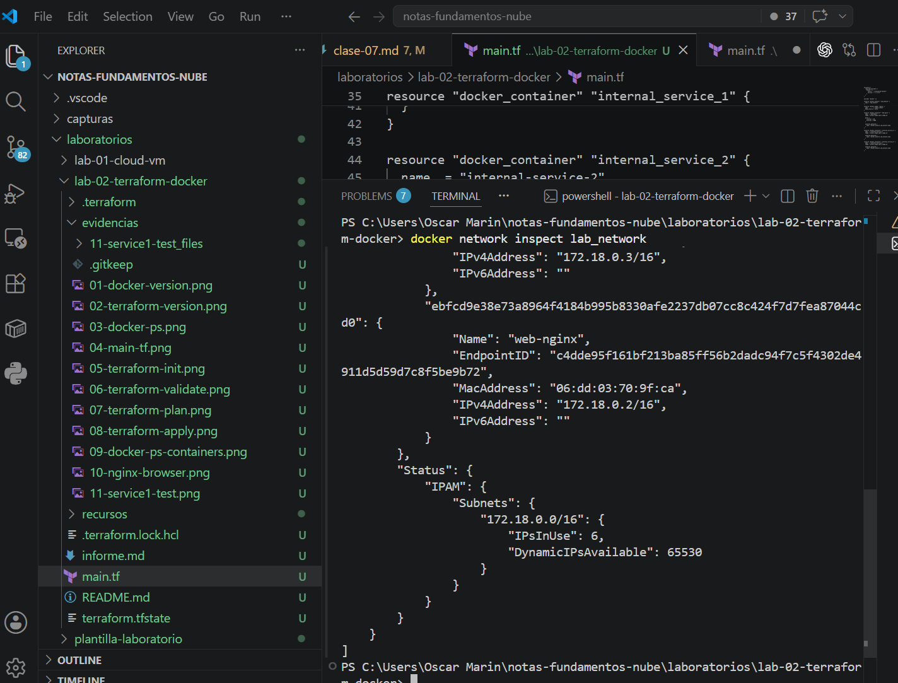

El comando `docker network inspect` muestra información detallada de una red Docker. Entre los datos más importantes se encuentran el identificador de la red, el controlador utilizado, el alcance, la subred, la puerta de enlace, las opciones de configuración y la lista de contenedores conectados con sus direcciones IP internas.

Esta información permitió validar que los tres contenedores del laboratorio pertenecían a la misma red y tenían conectividad interna. También sirve para diagnosticar problemas de comunicación y confirmar que los recursos creados por Terraform existen en Docker.

## Parte 7 - Realización de cambios

Posteriormente se modificó el puerto externo del contenedor `web-nginx`. Al inicio el puerto publicado era `8080`, pero luego se cambió a `9090` dentro del bloque `ports` del recurso `docker_container.web_nginx`.

Cambio aplicado en `main.tf`:

```hcl
ports {
  internal = 80
  external = 9090
}
```

Comando utilizado para revisar el cambio:

```powershell
terraform plan
```

Evidencia:

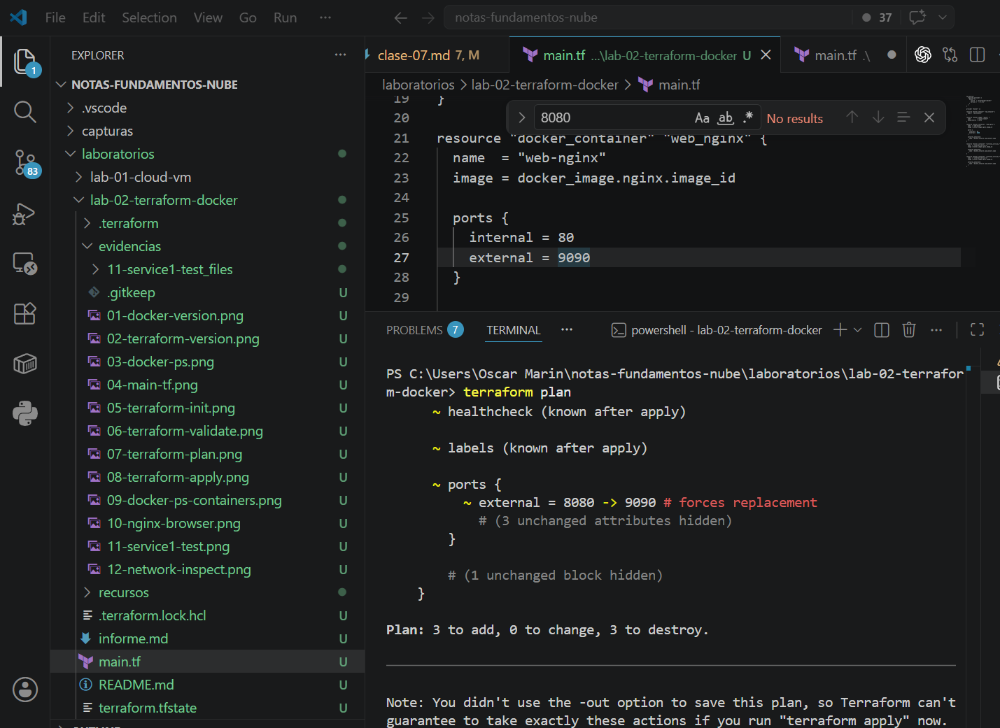

Al ejecutar `terraform plan`, Terraform detectó que la configuración deseada en `main.tf` ya no coincidía con el estado registrado en `terraform.tfstate` ni con la configuración previa del contenedor. Esto ocurrió porque el puerto externo cambió de `8080` a `9090`.

En Terraform, el estado deseado es lo que está definido en los archivos `.tf`. El estado actual corresponde a los recursos que existen en la infraestructura y al registro que Terraform mantiene en `terraform.tfstate`. Cuando hay diferencias entre ambos, Terraform calcula qué acciones necesita realizar para que la infraestructura vuelva a coincidir con la configuración definida.

En este caso, el cambio del puerto externo obligó a recrear el recurso. La publicación de puertos de un contenedor Docker no se modifica de forma directa sobre un contenedor ya creado; normalmente se debe crear un contenedor nuevo con la nueva configuración. Por esta razón, Terraform marcó el recurso para reemplazo en lugar de aplicar solo una actualización simple.

Comando utilizado para aplicar el cambio:

```powershell
terraform apply
```

Después de aplicar el cambio, el acceso esperado al servicio Nginx queda en:

```text
http://localhost:9090
```

## Parte 8 - Destrucción de infraestructura

Al finalizar el laboratorio se debe destruir la infraestructura creada para liberar recursos locales y comprobar que Terraform puede administrar también la eliminación de los recursos.

Comando pendiente:

```powershell
terraform destroy
```

Verificación pendiente posterior a la destrucción:

```powershell
docker ps -a
```

```powershell
docker network ls
```

Marcadores de evidencias pendientes:

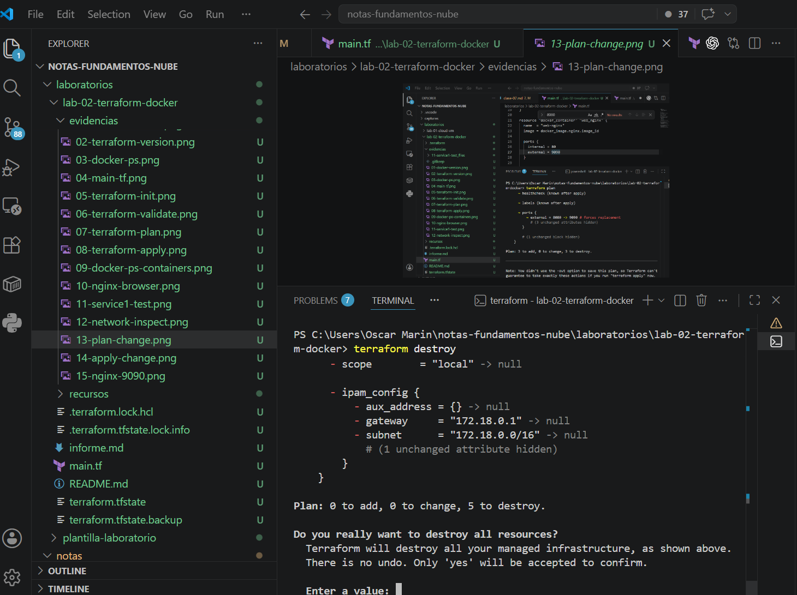

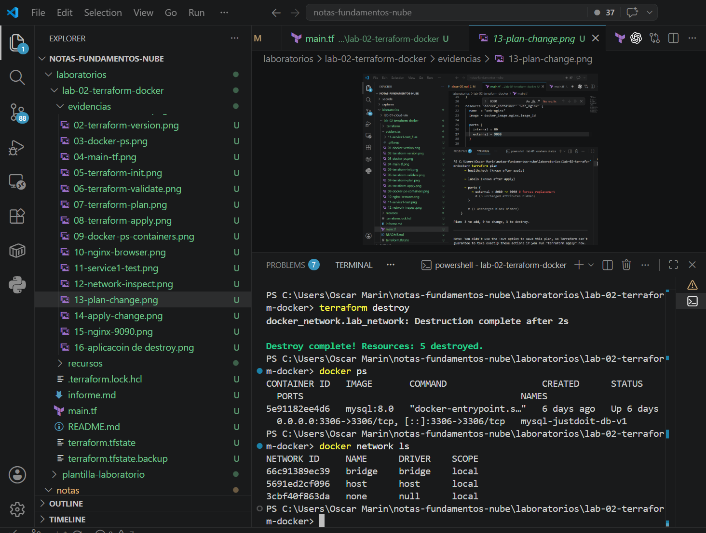

## Problemas encontrados y solución aplicada

| Problema | Causa probable | Solución aplicada |
| --- | --- | --- |
| Era necesario comprobar que Terraform y Docker estuvieran disponibles antes del despliegue. | Terraform necesita comunicarse con Docker para administrar los recursos definidos en `main.tf`. | Se ejecutaron `docker --version`, `terraform version` y `docker ps` antes de iniciar el despliegue. |
| Los contenedores internos no tenían puertos publicados hacia el equipo local. | Solo `web-nginx` necesitaba acceso desde el navegador; los otros servicios se usaron para pruebas internas. | Se validaron mediante comunicación interna usando `docker exec` y `curl` dentro de la red personalizada. |
| El cambio del puerto externo no se aplicaba como una modificación directa. | La configuración de puertos de un contenedor Docker requiere recrear el contenedor. | Se revisó `terraform plan` para entender el reemplazo y luego se aplicó el cambio con `terraform apply`. |
| Quedan evidencias finales pendientes. | La destrucción de infraestructura y la verificación final todavía no se han documentado con capturas. | Se dejaron marcadores en el informe para agregar `14-terraform-destroy.png` y `15-verificacion-final.png`. |

## Conclusiones

En este laboratorio comprendí cómo Terraform permite administrar infraestructura local de Docker mediante archivos de configuración. Al definir la red, la imagen y los contenedores en `main.tf`, pude representar la infraestructura como código y repetir el despliegue de una forma más ordenada que si hubiera ejecutado todos los comandos manualmente.

También observé la importancia del Provider, ya que funciona como el enlace entre Terraform y Docker. Sin este componente, Terraform no podría interpretar cómo crear contenedores, imágenes o redes dentro del entorno local.

Aprendí que el archivo `terraform.tfstate` es fundamental para que Terraform conozca los recursos que administra. Este archivo permite comparar el estado actual con el estado deseado y detectar cambios, como la modificación del puerto externo de `8080` a `9090`.

Además, comprobé que una red personalizada de Docker facilita la comunicación interna entre contenedores. En lugar de depender de direcciones IP, los contenedores pueden comunicarse usando nombres como `web-nginx` e `internal-service-2`, lo cual hace que la configuración sea más estable y fácil de mantener.

Finalmente, concluyo que Terraform y Docker se complementan bien para practicar conceptos de infraestructura en la nube. Aunque el laboratorio se realizó de forma local, los principios de infraestructura como código, estado deseado, despliegue reproducible y administración de cambios también se aplican en entornos reales de nube.
