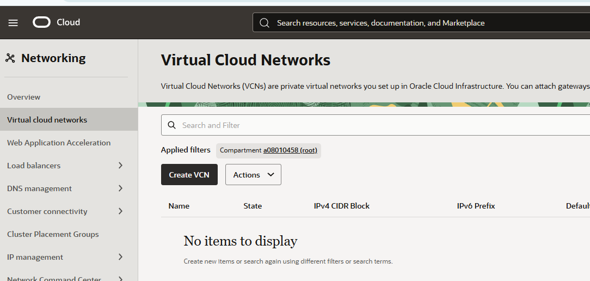

# Laboratorio 3 – Creación de una Máquina Virtual en Oracle Cloud Infrastructure (OCI)

## Datos Generales

**Curso:** Fundamentos de Computación en la Nube

**Laboratorio:** 3

**Tema:** Creación de una Máquina Virtual en Oracle Cloud Infrastructure (OCI)

**Estudiante:** Oscar Marín Zamora

**Fecha:** Junio 2026

---

# Objetivo

Crear una máquina virtual en Oracle Cloud Infrastructure (OCI), configurando los recursos de red necesarios para permitir el acceso desde Internet mediante una dirección IP pública. Además, documentar detalladamente el procedimiento realizado para que pueda ser reproducido por un usuario sin experiencia previa en la plataforma.

---

# Parte 1 – Exploración del entorno

## Ingreso a la consola de OCI

Se accede a Oracle Cloud Infrastructure utilizando las credenciales proporcionadas por Oracle Academy.

Una vez autenticado, se visualiza la consola principal de OCI, desde donde es posible administrar servicios de cómputo, redes, almacenamiento y otros recursos de nube.

### Evidencia

### Explicación

La consola de OCI constituye el punto central de administración de todos los recursos disponibles dentro de la cuenta.

---

## Identificación del compartimento

Desde el menú principal se verifica el compartimento que será utilizado para almacenar los recursos creados durante el laboratorio.

### Evidencia

### Explicación

Los compartimentos permiten organizar recursos y facilitar la administración de permisos y servicios.

---

## Identificación de la región

Se verifica la región activa desde la parte superior derecha de la consola.

### Evidencia

### Explicación

La región determina el centro de datos físico donde se desplegarán los recursos utilizados durante el laboratorio.

---

## Parte 2 – Configuración de red

## Paso 1. Ingreso al módulo Virtual Cloud Networks (VCN)

Se accedió al servicio de redes virtuales de Oracle Cloud Infrastructure. Desde esta sección se administran las VCN que permiten la comunicación entre los recursos desplegados en la nube.

Como no existían VCN configuradas, se procedió a crear una nueva red virtual.

### Evidencia

La captura anterior forma parte de la carpeta `capturas`, la cual será compartida posteriormente con los compañeros como evidencia del procedimiento realizado.

### Explicación

El módulo Virtual Cloud Networks permite crear y administrar redes virtuales privadas dentro de OCI. Estas redes son necesarias para conectar la máquina virtual con otros recursos y, posteriormente, habilitar el acceso desde Internet mediante la configuración correspondiente.

---

## Parte 3 – Creación de la máquina virtual

## Parte 4 – Acceso desde Internet

## Parte 5 – Validación de conectividad

## Problemas encontrados y soluciones aplicadas

## Conclusiones

## Evidencias

Las siguientes capturas se encuentran organizadas dentro de la carpeta `capturas`, la cual será compartida posteriormente con los compañeros como respaldo del procedimiento realizado.

