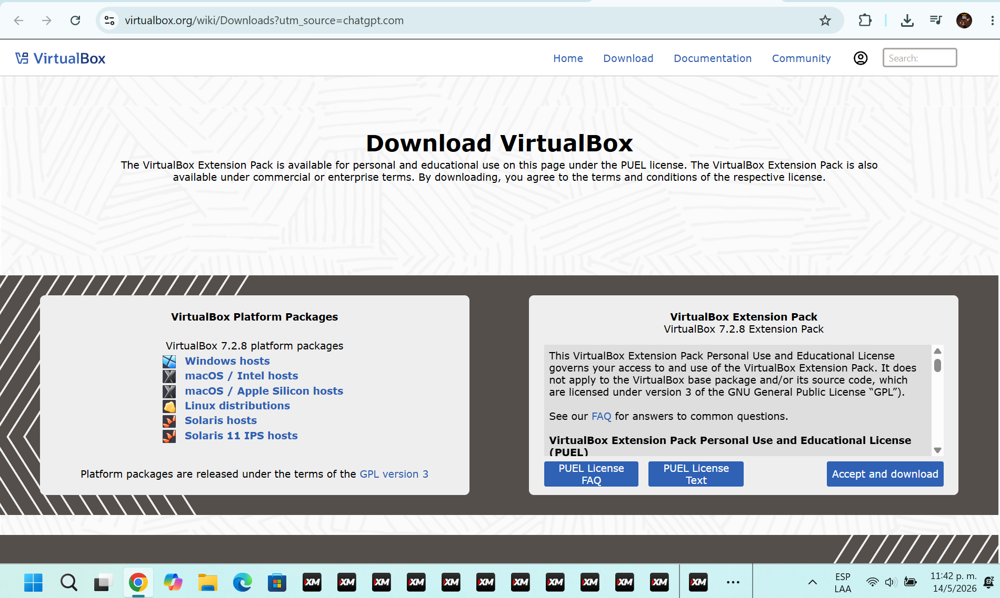
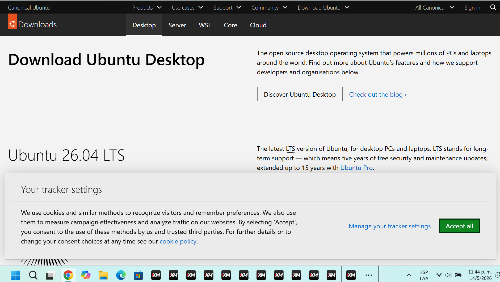
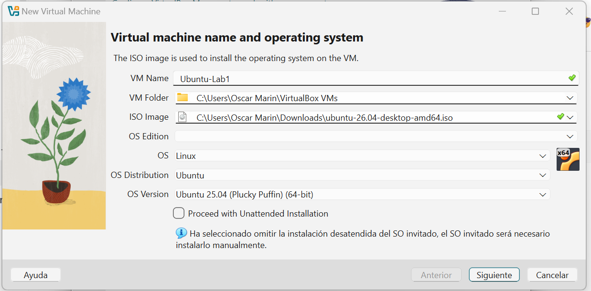
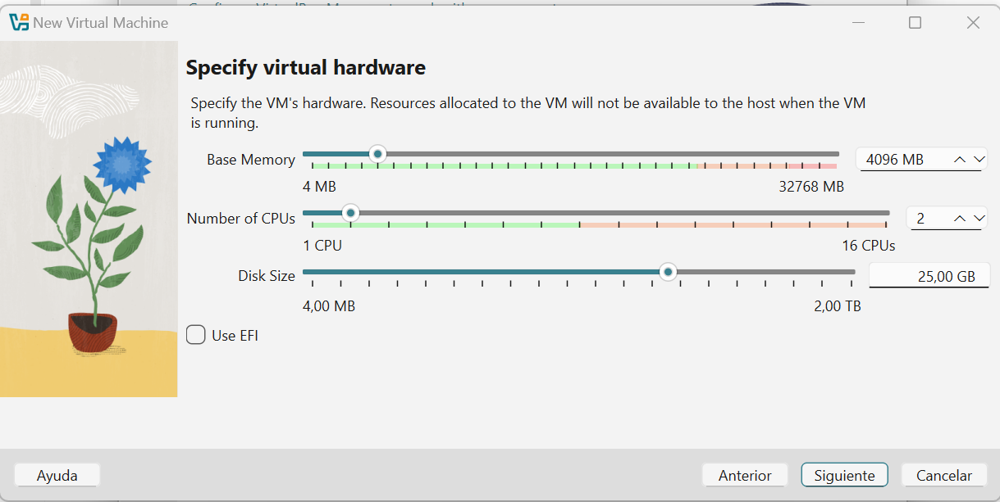
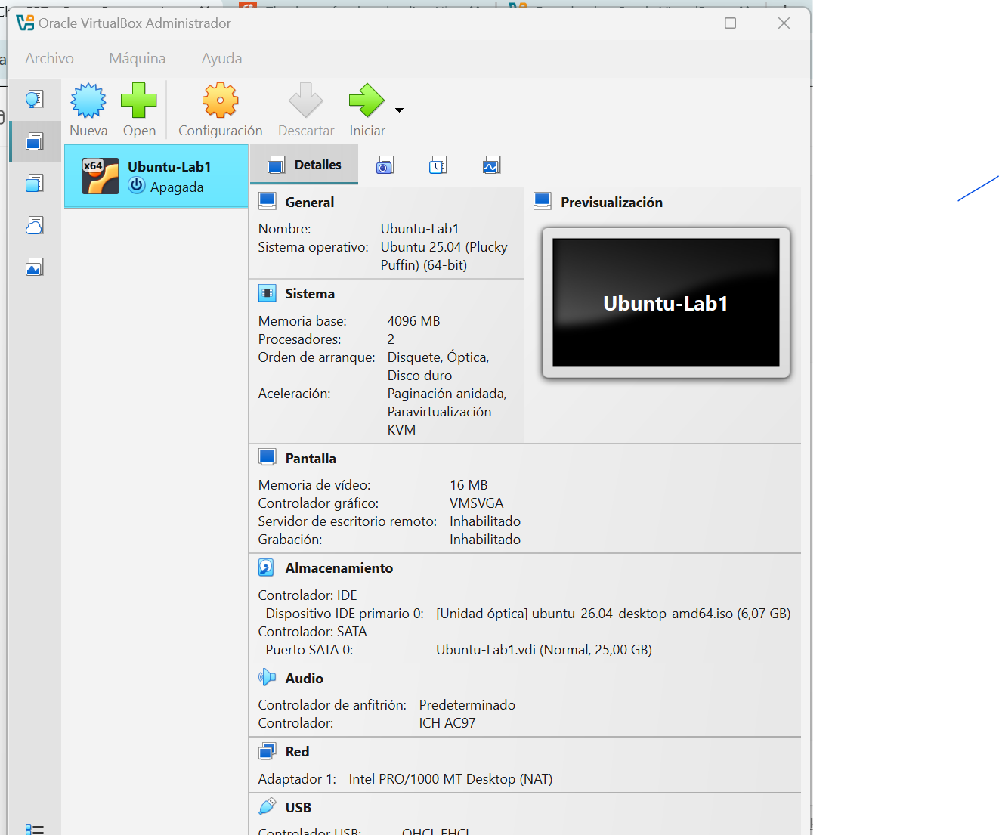
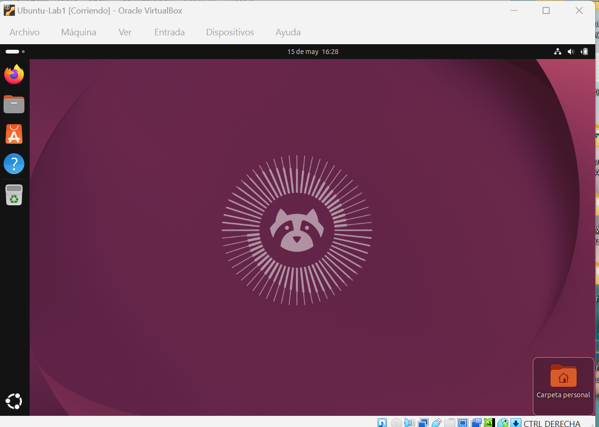
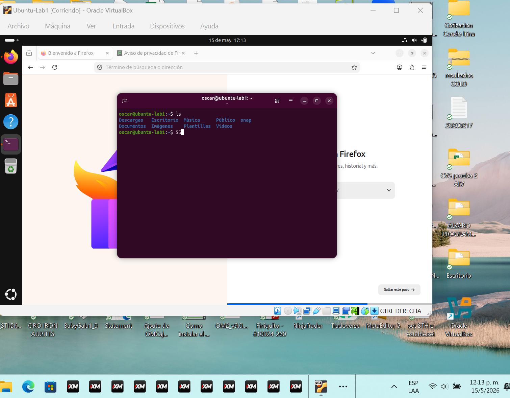

# Laboratorio 1 - Comparación de tipos de nube y proveedores cloud (VM)

- **Curso:** Fundamentos de Programación en la Nube
- **Estudiante:** Oscar Marín Zamora
- **Tema:** Tipos de nube, proveedores cloud y máquinas virtuales
- **Estado:** Finalizado
- **Fecha:** 15 de mayo de 2026

---

## Objetivos

### Objetivo general

Analizar los principales tipos de nube, comparar proveedores de nube pública y relacionar sus servicios con el uso de máquinas virtuales en escenarios reales.

### Objetivos específicos

- Identificar las diferencias entre nube pública, privada, híbrida y comunitaria.
- Comparar proveedores cloud como AWS, Microsoft Azure y Google Cloud.
- Describir un escenario hipotético donde se requiera implementar una máquina virtual.
- Comparar opciones de máquinas virtuales según recursos, costos y facilidad de uso.
- Documentar el proceso de virtualización local como práctica base para comprender entornos cloud.
- Registrar evidencias del proceso mediante capturas y observaciones.

---

## Parte 1: Tipos de nube

### Nube pública

La nube pública es un modelo donde los recursos tecnológicos son ofrecidos por un proveedor externo a través de internet. Los usuarios pueden acceder a servicios como almacenamiento, bases de datos, redes, aplicaciones y máquinas virtuales sin administrar directamente la infraestructura física.

**Ejemplos:** AWS, Microsoft Azure, Google Cloud.

**Ventajas:**

- No requiere comprar servidores propios.
- Permite pagar según el consumo.
- Facilita el crecimiento rápido de recursos.
- El proveedor se encarga de gran parte del mantenimiento.

**Desventajas:**

- Depende de la conexión a internet.
- Puede generar costos variables si no se controla el consumo.
- Requiere configurar correctamente la seguridad.

### Nube privada

La nube privada es utilizada por una sola organización. Puede estar ubicada dentro de la empresa o ser administrada por un tercero, pero sus recursos no se comparten con otros clientes.

**Ventajas:**

- Mayor control sobre la infraestructura.
- Mejor adaptación a políticas internas.
- Puede ofrecer mayor privacidad para datos sensibles.

**Desventajas:**

- Mayor costo de implementación.
- Requiere personal técnico especializado.
- Menor flexibilidad inicial en comparación con la nube pública.

### Nube híbrida

La nube híbrida combina servicios de nube pública y nube privada. Permite mantener ciertos datos o sistemas en infraestructura privada y utilizar servicios públicos para otras necesidades.

**Ventajas:**

- Balance entre control y escalabilidad.
- Permite mover cargas de trabajo según la necesidad.
- Es útil para empresas con sistemas existentes que migran gradualmente a la nube.

**Desventajas:**

- Puede ser más compleja de administrar.
- Requiere buena integración entre ambientes.
- La seguridad debe manejarse de forma coordinada.

### Nube comunitaria

La nube comunitaria es compartida por varias organizaciones con necesidades similares, por ejemplo instituciones educativas, entidades gubernamentales o empresas de un mismo sector.

**Ventajas:**

- Permite compartir costos.
- Atiende necesidades comunes de seguridad o cumplimiento.
- Facilita la colaboración entre organizaciones relacionadas.

**Desventajas:**

- Menos flexible que una nube pública.
- Requiere acuerdos claros entre participantes.
- Puede tener disponibilidad limitada según la comunidad.

---

## Parte 2: Proveedores de nube pública

### Amazon Web Services (AWS)

AWS es uno de los proveedores de nube pública más utilizados. Ofrece servicios de cómputo, almacenamiento, redes, bases de datos, inteligencia artificial, seguridad y monitoreo.

**Servicio de máquinas virtuales:** Amazon EC2.

**Características principales:**

- Amplia variedad de tipos de instancia.
- Opciones de pago por uso, instancias reservadas y planes de ahorro.
- Integración con servicios como S3, VPC, IAM y CloudWatch.

### Microsoft Azure

Microsoft Azure es la plataforma cloud de Microsoft. Es muy utilizada en empresas que trabajan con Windows Server, Active Directory, Microsoft 365, SQL Server y herramientas empresariales de Microsoft.

**Servicio de máquinas virtuales:** Azure Virtual Machines.

**Características principales:**

- Buena integración con tecnologías Microsoft.
- Soporte para Linux y Windows.
- Opciones de redes, seguridad, monitoreo y escalabilidad.

### Google Cloud Platform (GCP)

Google Cloud Platform es la plataforma de nube de Google. Destaca en análisis de datos, inteligencia artificial, contenedores, redes globales y servicios administrados.

**Servicio de máquinas virtuales:** Compute Engine.

**Características principales:**

- Buen rendimiento de red.
- Integración con Kubernetes y servicios de datos.
- Opciones flexibles de configuración de máquinas virtuales.

---

## Parte 3: Escenario hipotético de VM

Una pequeña empresa necesita publicar una aplicación web interna para que su equipo pueda registrar información de clientes y consultar reportes básicos. La empresa no desea comprar servidores físicos porque el uso inicial será pequeño, pero espera que el sistema pueda crecer con el tiempo.

Para este caso, una máquina virtual en la nube sería una opción adecuada porque permite:

- Instalar un sistema operativo según las necesidades del proyecto.
- Configurar CPU, memoria RAM y disco de acuerdo con la carga esperada.
- Aumentar recursos si la aplicación crece.
- Acceder al servidor de forma remota.
- Pagar únicamente por los recursos utilizados.

Una configuración inicial podría incluir:

| Recurso | Configuración hipotética |
| --- | --- |
| Sistema operativo | Ubuntu Server LTS |
| CPU | 1 o 2 vCPU |
| RAM | 2 GB a 4 GB |
| Disco | 30 GB SSD |
| Uso principal | Aplicación web interna |
| Acceso | SSH |

---

## Parte 4: Comparación de VM

| Criterio | AWS EC2 | Azure Virtual Machines | Google Compute Engine |
| --- | --- | --- | --- |
| Servicio principal | EC2 | Virtual Machines | Compute Engine |
| Sistemas operativos | Linux y Windows | Linux y Windows | Linux y Windows |
| Escalabilidad | Alta | Alta | Alta |
| Modelo de pago | Pago por uso, reservas y ahorros | Pago por uso y reservas | Pago por uso y descuentos automáticos |
| Facilidad inicial | Media | Media | Media |
| Integración destacada | Servicios AWS | Ecosistema Microsoft | Datos, red y Kubernetes |
| Uso recomendado | Ambientes flexibles y variados | Empresas con tecnologías Microsoft | Datos, contenedores y servicios modernos |

### Análisis breve

Los tres proveedores permiten crear máquinas virtuales con características similares: selección de sistema operativo, recursos configurables, acceso remoto, redes y reglas de seguridad. La elección depende del contexto del proyecto, el presupuesto, la experiencia del equipo y los servicios adicionales que se necesiten.

Para una empresa que ya utiliza Microsoft 365 o Windows Server, Azure puede ser una opción natural. Para proyectos con mucha variedad de servicios cloud, AWS ofrece un ecosistema muy amplio. Para proyectos relacionados con análisis de datos, contenedores o herramientas de Google, GCP puede ser conveniente.

---

## Parte 5: Virtualización local

La virtualización local permite crear una máquina virtual en una computadora personal. Esta práctica ayuda a comprender conceptos que también se usan en la nube, como asignación de CPU, memoria RAM, almacenamiento, instalación de sistemas operativos y administración de recursos.

### Software de virtualización utilizado

- **Software:** Oracle VM VirtualBox
- **Versión:** VirtualBox 7.2.8
- **Sistema operativo anfitrión:** Windows
- **Sistema operativo invitado:** Ubuntu 26.04 Desktop

### Evidencia 1: descarga del software de virtualización

Captura de la página oficial de descarga de VirtualBox.

### Evidencia 2: descarga de Ubuntu

Captura de la página oficial de descarga de Ubuntu Desktop, sistema operativo seleccionado para la máquina virtual.

### Evidencia 3: creación de la máquina virtual

Captura del asistente de VirtualBox donde se define el nombre de la máquina virtual, la imagen ISO y el sistema operativo invitado.

### Evidencia 4: configuración de CPU, RAM y disco

Captura de la asignación de recursos de hardware para la VM: memoria RAM, cantidad de CPU y tamaño de disco.

### Evidencia 5: máquina virtual creada en VirtualBox

Captura del administrador de VirtualBox donde se observa la VM creada con sus recursos principales configurados.

### Evidencia 6: instalación de Ubuntu

No se cuenta con una captura específica del asistente de instalación. Como evidencia del resultado del proceso, se muestra la máquina virtual con Ubuntu iniciado correctamente en la siguiente sección.

<!-- Pendiente: evidencias/05-instalacion-ubuntu.png -->

### Evidencia 7: VM encendida y funcionando

Captura de la máquina virtual Ubuntu iniciada correctamente dentro de VirtualBox.

### Evidencia 8: terminal Linux

Captura de la terminal de Linux abierta dentro de Ubuntu. Esta evidencia valida que el sistema operativo invitado está operativo y listo para ejecutar comandos.

---

## Parte 6: Comparación y conclusión

La virtualización local y las máquinas virtuales en la nube tienen conceptos en común. En ambos casos se asignan recursos como CPU, memoria RAM, disco y sistema operativo. También se requiere administrar acceso, seguridad y uso de recursos.

La principal diferencia es que una VM local depende de la capacidad de la computadora personal, mientras que una VM en la nube utiliza infraestructura de un proveedor externo. En la nube es más sencillo aumentar recursos, crear nuevas instancias, respaldar información y acceder desde diferentes ubicaciones.

En conclusión, las máquinas virtuales son una base importante para comprender la computación en la nube. Permiten practicar conceptos de infraestructura, sistemas operativos, redes y administración de servicios. Además, comparar proveedores cloud ayuda a tomar mejores decisiones según el tipo de proyecto, presupuesto y necesidades técnicas.

---

## Evidencias pendientes

- [x] Captura de descarga del software de virtualización.
- [x] Captura de descarga de Ubuntu.
- [x] Captura de creación de la VM.
- [x] Captura de configuración de CPU, RAM y disco.
- [x] Captura de VM creada en VirtualBox.
- [ ] Captura específica del asistente de instalación de Ubuntu.
- [x] Captura de VM encendida y funcionando.
- [x] Captura de terminal Linux.
- [x] Datos finales del software usado.
- [x] Revisión general de formato antes de exportar a PDF.

---

## Problemas encontrados y solución aplicada

| Problema | Causa probable | Solución aplicada |
| --- | --- | --- |
| El PDF no mostraba todas las evidencias. | El PDF había sido generado antes de guardar los cambios finales del README. | Se guardó nuevamente el archivo Markdown para regenerar el PDF actualizado. |
| No se cuenta con captura específica del asistente de instalación de Ubuntu. | La captura no fue registrada durante ese paso. | Se dejó indicado como pendiente y se incluyó evidencia del sistema Ubuntu funcionando después de la instalación. |

### Observaciones

El laboratorio queda documentado con evidencias reales disponibles en la carpeta `evidencias/`. Las rutas usadas son relativas para mantener compatibilidad con VS Code Preview, Markdown PDF y GitHub Markdown.

---

## Evidencia técnica de fechas del documento

Esta sección registra metadatos locales del archivo fuente y de los PDF generados para el Laboratorio 1. Su propósito es documentar la existencia y generación del trabajo antes de la fecha límite oficial de entrega.

### Archivo fuente Markdown

| Archivo | Fecha de creación | Última modificación | Observación |
| --- | --- | --- | --- |
| `laboratorios/lab-01-cloud-vm/README.md` | 14 de mayo de 2026, 23:14:14 | 15 de mayo de 2026, 12:21:35 | Archivo fuente del laboratorio usado para documentar el contenido y evidencias. |

### PDF generado desde el README del laboratorio

| Archivo | Fecha de creación del archivo | Última modificación del archivo | Metadata interna del PDF |
| --- | --- | --- | --- |
| `laboratorios/lab-01-cloud-vm/README.pdf` | 14 de mayo de 2026, 23:18:58 | 15 de mayo de 2026, 12:05:04 | `CreationDate` y `ModDate`: 15 de mayo de 2026, 12:05:03 hora Costa Rica. |

### PDF final de entrega del Laboratorio 1

| Archivo | Fecha de creación del archivo | Última modificación del archivo | Metadata interna del PDF |
| --- | --- | --- | --- |
| `laboratorios/lab-01-cloud-vm/pdf/Lab1_FCN_2026_Oscar_Marin_Zamora.pdf` | 15 de mayo de 2026, 12:21:01 | 15 de mayo de 2026, 12:22:18 | `CreationDate` y `ModDate`: 15 de mayo de 2026, 12:22:17 hora Costa Rica. |

### Interpretación

Los metadatos anteriores muestran que el documento del Laboratorio 1 y su PDF final ya existían el viernes 15 de mayo de 2026 al mediodía, antes de la medianoche de la fecha oficial de entrega. El repositorio Git registra además que la estructura `laboratorios/lab-01-cloud-vm/` ya existía en el commit `09c9379` del 14 de mayo de 2026.
