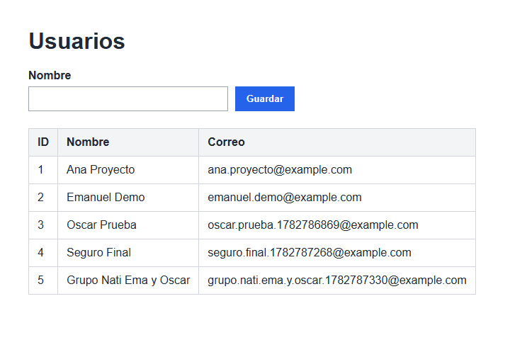

# Proyecto Final

## Curso: Fundamentos de Computación en la Nube

**Profesor:** Carlos Arias Rodríguez

## Grupo 2

Integrantes:

- Nathalie López
- Emanuel
- Oscar Marín

---

# Desarrollo de la Infraestructura en Oracle Cloud con Terraform

## 1. Introducción

El Proyecto Final tomó como base la infraestructura desarrollada en el Laboratorio 4, en el cual se había trabajado la creación de una máquina virtual en Oracle Cloud Infrastructure mediante Terraform. A partir de esa base, la configuración fue ampliada para cumplir los requerimientos del proyecto, incorporando una arquitectura con red pública, red privada, una máquina virtual para la aplicación y una máquina virtual separada para la base de datos.

Toda la infraestructura fue administrada mediante Terraform, lo que permitió definir los recursos como código, validar los cambios antes de aplicarlos y mantener un estado controlado de los componentes desplegados. Oracle Cloud Infrastructure fue la plataforma utilizada para implementar la red, las reglas de seguridad, las tablas de rutas y las instancias de cómputo necesarias.

## Figura 1. Infraestructura creada en Oracle Cloud

> **[Insertar aquí la Figura 1]**

La figura debe mostrar una vista general de los recursos principales creados en Oracle Cloud Infrastructure para el Proyecto Final.

---

## 2. Arquitectura implementada

La arquitectura implementada se organizó dentro de una Virtual Cloud Network con el bloque `10.0.0.0/16`. Esta VCN funciona como la red principal del proyecto y contiene dos subredes con propósitos distintos.

La subred pública `10.0.1.0/24` aloja la máquina virtual `lab4-oci-vm`, encargada de servir como punto de entrada para la aplicación Flask y para la administración del entorno. Esta VM cuenta con la IP pública `129.80.190.44` y la IP privada `10.0.1.176`.

La subred privada `10.0.2.0/24` aloja la máquina virtual `proyecto-final-db-vm`, destinada a la base de datos MySQL/MariaDB. Esta instancia utiliza la IP privada `10.0.2.45` y no posee IP pública, lo que evita que sea accesible directamente desde Internet.

La separación entre la capa de aplicación y la capa de base de datos permite que la aplicación se ejecute en la VM pública, mientras que los datos se mantienen protegidos en una instancia privada. La comunicación entre ambas máquinas se realiza por medio de la red interna de OCI. Para permitir la instalación de paquetes desde los repositorios de Oracle Linux en la VM privada, se agregó un NAT Gateway como salida controlada desde la subred privada, sin asignar IP pública a la base de datos y sin abrir acceso entrante desde Internet.

```text
Internet
   |
   v
VM pública: lab4-oci-vm
IP pública: 129.80.190.44
IP privada: 10.0.1.176
   |
   v
Subred pública: 10.0.1.0/24
   |
   v
VCN: 10.0.0.0/16
   |
   v
Subred privada: 10.0.2.0/24
   |
   v
VM privada: proyecto-final-db-vm
IP privada: 10.0.2.45
Sin IP pública

Salida controlada desde subred privada:
Subred privada -> NAT Gateway -> Internet
```

## Figura 2. VCN

> **[Insertar aquí la Figura 2]**

La figura debe mostrar la VCN `lab4-vcn`, su bloque CIDR `10.0.0.0/16` y su estado en Oracle Cloud.

## Figura 3. Subred pública

> **[Insertar aquí la Figura 3]**

La figura debe mostrar la subred pública `lab4-public-subnet`, asociada al bloque `10.0.1.0/24`.

## Figura 4. Subred privada

> **[Insertar aquí la Figura 4]**

La figura debe mostrar la subred privada `lab4-private-subnet`, asociada al bloque `10.0.2.0/24` y configurada sin asignación de IP pública.

## Figura 5. Máquina virtual pública

> **[Insertar aquí la Figura 5]**

La figura debe mostrar la instancia `lab4-oci-vm`, incluyendo su IP pública `129.80.190.44` y su IP privada `10.0.1.176`.

## Figura 6. Máquina virtual privada

> **[Insertar aquí la Figura 6]**

La figura debe mostrar la instancia `proyecto-final-db-vm`, su IP privada `10.0.2.45` y la ausencia de IP pública.

---

## 3. Configuración de seguridad

La configuración de seguridad se diseñó para separar el tráfico externo del tráfico interno. La VM pública permite los puertos necesarios para administración y acceso web: SSH por el puerto `22`, HTTP por el puerto `80` y HTTPS por el puerto `443`.

La VM privada no tiene acceso directo desde Internet. En esta instancia se permite SSH interno desde la red del proyecto y el puerto `3306` para MySQL/MariaDB únicamente desde la subred pública. Además, la subred privada cuenta con salida controlada mediante NAT Gateway para descargar paquetes del sistema operativo, sin permitir conexiones entrantes desde Internet. De esta manera, la base de datos queda protegida y solo puede recibir conexiones internas provenientes de la capa de aplicación.

## Figura 7. Security Lists

> **[Insertar aquí la Figura 7]**

La figura debe mostrar las listas de seguridad públicas y privadas, incluyendo las reglas para SSH, HTTP, HTTPS y MySQL/MariaDB.

## Figura 8. Route Tables

> **[Insertar aquí la Figura 8]**

La figura debe mostrar la tabla de rutas pública con salida hacia Internet Gateway y la tabla de rutas privada con salida controlada hacia NAT Gateway.

---

## 4. Implementación mediante Terraform

La infraestructura fue implementada mediante Terraform siguiendo el flujo normal de despliegue. Primero se revisó el formato de los archivos, luego se validó la configuración con `terraform validate`, se revisó el plan de ejecución con `terraform plan` y finalmente se aplicaron los cambios con `terraform apply`.

El comando `terraform validate` confirmó que la configuración era válida. Posteriormente, `terraform apply` creó correctamente los recursos definidos, incluyendo la VCN, el Internet Gateway, el NAT Gateway, las tablas de rutas, las listas de seguridad, las subredes y las dos máquinas virtuales.

Como parte de la validación final, `terraform plan` mostró el resultado:

```text
No changes. Your infrastructure matches the configuration.
```

Este resultado indica que la infraestructura desplegada en Oracle Cloud coincide con el código Terraform. Además, el Terraform State contiene todos los recursos esperados y mantiene la relación entre el código y los recursos reales.

Los recursos administrados por Terraform son:

```text
oci_core_vcn.lab4_vcn
oci_core_internet_gateway.lab4_internet_gateway
oci_core_nat_gateway.lab4_nat_gateway
oci_core_route_table.lab4_public_route_table
oci_core_route_table.lab4_private_route_table
oci_core_security_list.lab4_public_security_list
oci_core_security_list.lab4_private_security_list
oci_core_subnet.lab4_public_subnet
oci_core_subnet.lab4_private_subnet
oci_core_instance.lab4_vm
oci_core_instance.proyecto_final_db_vm
```

## Figura 9. Terraform Apply exitoso

> **[Insertar aquí la Figura 9]**

La figura debe mostrar la ejecución exitosa de `terraform apply` con los recursos creados correctamente.

## Figura 10. Terraform Plan sin cambios

> **[Insertar aquí la Figura 10]**

La figura debe mostrar el resultado `No changes. Your infrastructure matches the configuration.`

## Figura 11. Terraform State

> **[Insertar aquí la Figura 11]**

La figura debe mostrar el estado de Terraform con los recursos principales administrados por el proyecto.

## Figura 12. Terraform Outputs

> **[Insertar aquí la Figura 12]**

La figura debe mostrar las salidas de Terraform con los datos principales de la VM pública, la VM privada y sus direcciones.

## Evidencias complementarias del código Terraform

Además de las validaciones de ejecución, se incluyeron capturas del código Terraform utilizado para construir la infraestructura. Estas evidencias permiten mostrar que los recursos fueron definidos como código y que la arquitectura no fue creada manualmente desde la consola.

## Figura 16. Configuración del proveedor y variables

> **[Insertar aquí la Figura 16]**

La figura debe mostrar la configuración general de Terraform, incluyendo el proveedor de OCI y las variables utilizadas por el proyecto.

## Figura 17. Archivo network.tf

> **[Insertar aquí la Figura 17]**

La figura debe mostrar la definición de la VCN, subredes, tablas de rutas y listas de seguridad en el archivo `network.tf`.

## Figura 18. Archivo compute.tf

> **[Insertar aquí la Figura 18]**

La figura debe mostrar la definición de la máquina virtual pública `lab4-oci-vm` y su asociación con la subred pública.

## Figura 19. Archivo outputs.tf

> **[Insertar aquí la Figura 19]**

La figura debe mostrar las salidas configuradas en Terraform para documentar los datos principales de la infraestructura.

## Figura 20. Terraform Init

> **[Insertar aquí la Figura 20]**

La figura debe mostrar la inicialización correcta del directorio Terraform y la descarga/configuración del proveedor requerido.

## Figura 21. Terraform Validate

> **[Insertar aquí la Figura 21]**

La figura debe mostrar la validación exitosa de la configuración de Terraform.

## Figura 22. Terraform Plan

> **[Insertar aquí la Figura 22]**

La figura debe mostrar la revisión del plan de Terraform antes de aplicar los recursos en OCI.

## Figura 23. Terraform Apply

> **[Insertar aquí la Figura 23]**

La figura debe mostrar la aplicación exitosa de la infraestructura mediante Terraform.

---

## 5. Incidentes encontrados durante el desarrollo

Durante la creación de la VM privada para base de datos se presentó el error `400-LimitExceeded`, asociado al límite `standard-e2-micro-core-count`. Este incidente se debió a que una máquina virtual antigua del Laboratorio 3 continuaba consumiendo cuota dentro de la cuenta Student.

Para liberar los recursos necesarios, se eliminó dicha instancia anterior junto con su Boot Volume. Después de liberar la cuota, Terraform pudo crear correctamente la VM privada `proyecto-final-db-vm`.

También se presentó un inconveniente temporal de acceso SSH hacia la VM pública, identificado mediante el mensaje:

```text
Connection timed out during banner exchange
```

El diagnóstico permitió confirmar que el puerto `22` respondía a nivel TCP, pero el servicio SSH no completaba el intercambio inicial. La conectividad quedó restablecida después de revisar la llave utilizada para la autenticación y realizar un reinicio normal de la instancia pública desde OCI.

---

## 6. Validaciones operativas finales

La validación operativa final confirmó que la infraestructura funcionaba correctamente. Se verificó el acceso SSH hacia la VM pública `lab4-oci-vm`, la comunicación desde esta VM hacia la VM privada `proyecto-final-db-vm` y el acceso SSH interno hacia la instancia privada.

Desde la VM pública se realizó una prueba de comunicación hacia `10.0.2.45`, con respuesta correcta. Además, se validó el acceso SSH interno hacia la VM privada utilizando la VM pública como punto de salto, obteniendo la respuesta:

```text
db-ok
```

También se ejecutó `terraform plan`, cuyo resultado fue `No changes`, confirmando que no existían diferencias entre Terraform, Oracle Cloud y la documentación técnica.

Como parte de la validación final, se comprobó que la VM privada mantiene únicamente IP privada y que la salida a Internet funciona mediante NAT Gateway para permitir `ping`, `curl` y acceso a repositorios `dnf`.

## Figura 13. Conexión SSH a la VM pública

> **[Insertar aquí la Figura 13]**

La figura debe mostrar el acceso SSH exitoso hacia la VM pública `lab4-oci-vm`.

## Figura 14. Comunicación VM pública a VM privada

> **[Insertar aquí la Figura 14]**

La figura debe mostrar la comunicación desde la VM pública hacia la IP privada `10.0.2.45`.

## Figura 15. Acceso SSH interno a la VM privada

> **[Insertar aquí la Figura 15]**

La figura debe mostrar el resultado `db-ok` al validar el acceso SSH interno hacia la VM privada.

Con estas pruebas se confirmó que la infraestructura coincide con el código Terraform, con los recursos desplegados en Oracle Cloud y con la documentación técnica del proyecto.

---

## 7. IMPLEMENTACION DE LA BASE DE DATOS PRIVADA Y LA APLICACION WEB

Una vez finalizada la infraestructura en Oracle Cloud Infrastructure, se implemento la capa funcional del proyecto. Esta fase incluyo la configuracion de la base de datos MariaDB en la VM privada y el despliegue de una aplicacion web Flask en la VM publica, manteniendo la separacion de red definida mediante Terraform.

El objetivo de esta etapa fue validar el flujo completo entre la aplicacion y la base de datos sin exponer directamente el servidor de base de datos a Internet. La VM publica recibe las solicitudes web, mientras que la VM privada conserva la persistencia de datos y solo acepta conexiones internas desde la subred publica del proyecto.

### 7.1 Configuracion de MariaDB

La base de datos fue instalada en la VM privada `proyecto-final-db-vm`, ubicada en la IP privada `10.0.2.45`. Durante la configuracion se recupero el acceso operativo a la VM, se estabilizo la memoria disponible mediante swap y posteriormente se instalo MariaDB.

El servicio de MariaDB quedo habilitado para iniciar automaticamente con el sistema operativo y se valido que permaneciera activo. La configuracion de acceso se mantuvo restringida al trafico interno del proyecto. Para permitir la comunicacion desde la VM publica hacia la base de datos, se habilito unicamente el puerto `3306` en el firewall local de la VM privada.

La base de datos no recibio IP publica en ningun momento. El acceso a MariaDB se realiza desde la red privada de OCI, utilizando la IP `10.0.2.45`.

### 7.2 Creacion de la base de datos

En MariaDB se creo la base de datos principal del proyecto:

```text
proyecto_final
```

Tambien se creo el usuario de aplicacion:

```text
flaskuser
```

Este usuario fue utilizado por Flask para conectarse a la base de datos desde la VM publica. La tabla creada para la prueba funcional fue:

```text
usuarios
```

La tabla almacena el identificador del registro, el nombre ingresado desde la aplicacion y un correo asociado. Se insertaron registros iniciales para validar la comunicacion entre la aplicacion web y MariaDB.

> **[Insertar aqui la Figura 25. Consulta SQL `SELECT * FROM usuarios;`]**

### 7.3 Implementacion de la aplicacion Flask

La aplicacion web fue desarrollada en Python utilizando Flask. Se desplego en la VM publica `lab4-oci-vm`, la cual cuenta con la IP publica `129.80.190.44`.

La aplicacion cumple las siguientes funciones:

- Muestra una pagina web con un formulario.
- Permite ingresar un nombre.
- Envia el dato a MariaDB por medio de la red privada.
- Consulta nuevamente la tabla `usuarios`.
- Muestra el listado actualizado en la misma pagina.

Para la conexion con MariaDB se utilizo `PyMySQL`, manteniendo las credenciales de conexion fuera del codigo principal mediante archivo de entorno. La aplicacion quedo configurada como servicio `systemd` para iniciar automaticamente con la VM y reiniciarse si el proceso se detiene.

El servicio configurado fue:

```text
proyecto-final-flask.service
```

### 7.4 Flujo de funcionamiento

El flujo funcional implementado mantiene separada la capa publica de la capa privada:

```text
Usuario
  |
  v
IP publica de la VM publica
  |
  v
Aplicacion Flask
  |
  v
Red privada de OCI
  |
  v
MariaDB en 10.0.2.45
  |
  v
Tabla usuarios
```

De esta forma, el usuario final interactua unicamente con la aplicacion web. La base de datos permanece aislada en la subred privada y no es accesible directamente desde Internet.

### 7.5 Pruebas funcionales

La aplicacion fue validada desde la IP publica de la VM:

```text
http://129.80.190.44/
```

Tambien se valido localmente en la VM publica mediante el puerto `5000`, usando:

```text
curl -i http://localhost:5000
```

Para acceso desde navegador se utilizo el puerto HTTP permitido en la infraestructura existente, por lo que la aplicacion quedo disponible publicamente en `http://129.80.190.44/`.

## Figura 24. Aplicacion Flask funcionando



La figura muestra la aplicacion cargada desde la IP publica de la VM. Se observa el formulario para ingresar nombres y el listado de usuarios recuperado desde MariaDB.

> **[Insertar aqui la Figura 26. Formulario con un nombre antes de presionar Guardar]**

> **[Insertar aqui la Figura 27. Mensaje de confirmacion `Nombre guardado correctamente`]**

> **[Insertar aqui la Figura 28. Tabla de usuarios actualizada despues de guardar]**

Tambien se probo la insercion de datos mediante una solicitud `POST` hacia la aplicacion. Despues de guardar el nombre, la pagina recargo el listado y mostro el nuevo registro almacenado.

La persistencia se verifico directamente en MariaDB con una consulta SQL sobre la tabla `usuarios`:

```text
SELECT * FROM usuarios;
```

> **[Insertar aqui la Figura 29. Resultado de `SELECT * FROM usuarios;`]**

Finalmente, se valido que la aplicacion se conecta a MariaDB usando la IP privada de la VM de base de datos:

```text
10.0.2.45
```

> **[Insertar aqui la Figura 30. Conexion MySQL desde la VM publica hacia 10.0.2.45]**

### 7.6 Resultados

La implementacion funcional quedo completada correctamente. MariaDB quedo operativo en la VM privada, Flask quedo operativo en la VM publica y la comunicacion entre ambos componentes se realiza por la red privada de OCI.

La aplicacion permite registrar nombres desde una pagina web, almacenar los datos en MariaDB y consultar nuevamente la tabla para mostrar el listado actualizado. La base de datos conserva su aislamiento, sin IP publica y sin acceso directo desde Internet.

No fue necesario modificar la arquitectura definida mediante Terraform para completar esta etapa funcional.

---

## Conclusión

La infraestructura del Proyecto Final fue implementada satisfactoriamente mediante Terraform en Oracle Cloud Infrastructure. La plataforma permitió desplegar una arquitectura con separación entre la capa de aplicación y la capa de base de datos, utilizando una subred pública para la VM de aplicación y una subred privada para la VM destinada a MySQL/MariaDB. La subred privada usa NAT Gateway para salida controlada a Internet sin exponer públicamente la base de datos.

Todas las pruebas de conectividad fueron exitosas. Se validó el acceso a la VM pública, la comunicación interna hacia la VM privada y la coincidencia entre Terraform, Oracle Cloud y la documentación generada.

La infraestructura quedó completamente validada y preparada para soportar la instalación de MySQL/MariaDB desde los repositorios de Oracle Linux y el despliegue de la aplicación Flask correspondiente al Proyecto Final.
