<div align="center">

<p><strong>Instituto Tecnológico de Costa Rica</strong></p>

<p><strong>Curso</strong><br>
Fundamentos de Computación en la Nube</p>

<br>
<br>
<br>

<h1>PROYECTO FINAL</h1>

<h3>Implementación de una Máquina Virtual con Aplicación Web y Base de Datos Privada en Oracle Cloud Infrastructure (OCI) utilizando Terraform</h3>

<br>
<br>
<br>

<p><strong>Profesor</strong><br>
Alonso Obando Carmona</p>

<br>

<p><strong>Integrantes</strong><br>
Natalia Martínez Villegas<br>
Emanuel Correa Jiménez<br>
Oscar Marín Zamora</p>

<br>
<br>
<br>

<p><strong>Fecha de entrega</strong><br>
29 de junio de 2026</p>

</div>

<br>
<br>

## Introducción

Este informe documenta la implementación de una solución en **Oracle Cloud Infrastructure (OCI)** compuesta por una máquina virtual pública para una aplicación web y una máquina virtual privada para una base de datos **MariaDB**. La infraestructura fue definida y administrada mediante **Terraform**, lo que permitió construir los recursos principales como código y validar su estado al finalizar el despliegue.

El proyecto integra redes virtuales, subredes públicas y privadas, reglas de seguridad, tablas de rutas, cómputo en la nube, una aplicación **Flask** y una base de datos relacional. La arquitectura busca permitir el acceso web desde Internet sin exponer directamente la base de datos, manteniendo la comunicación entre la aplicación y MariaDB dentro de la red privada de OCI.

### Resumen de la solución implementada

| Componente | Implementación |
|------------|----------------|
| Plataforma Cloud | Oracle Cloud Infrastructure (OCI) |
| Infraestructura como código | Terraform |
| Red virtual | VCN lab4-vcn (10.0.0.0/16) |
| Subred pública | lab4-public-subnet (10.0.1.0/24) |
| Subred privada | lab4-private-subnet (10.0.2.0/24) |
| Máquina virtual pública | lab4-oci-vm (Oracle Linux 9) |
| Máquina virtual privada | proyecto-final-db-vm (Oracle Linux 9) |
| Aplicación web | Python Flask |
| Base de datos | MariaDB |
| Conector de base de datos | PyMySQL |
| Comunicación entre capas | Red privada OCI (TCP 3306) |
| Acceso desde Internet | VM pública mediante HTTP (Puerto 5000 durante las pruebas) |
| Seguridad | Base de datos sin IP pública, comunicación privada y NAT Gateway para salida controlada |
| Resultado final | Aplicación web funcional conectada exitosamente con MariaDB mediante la red privada |

El cuadro anterior resume los principales componentes implementados durante el proyecto y permite identificar de forma rápida la arquitectura desplegada, las tecnologías utilizadas y la distribución de responsabilidades entre la infraestructura, la aplicación web y la base de datos.

## Objetivos

### Objetivo general

Implementar una arquitectura funcional en Oracle Cloud Infrastructure con una VM pública para una aplicación web Flask y una VM privada para MariaDB, utilizando Terraform para crear y administrar la infraestructura.

### Objetivos específicos

- Definir mediante Terraform la red, las subredes, las reglas de seguridad, las tablas de rutas y las máquinas virtuales requeridas.
- Separar la capa pública de aplicación y la capa privada de base de datos.
- Permitir acceso web a la aplicación desde Internet mediante la VM pública.
- Mantener MariaDB en una VM privada sin dirección IP pública.
- Validar la comunicación interna entre la VM pública y la VM privada.
- Comprobar el funcionamiento de la aplicación Flask con registros almacenados en MariaDB.

## Arquitectura

### Arquitectura implementada

La solución se diseñó con una arquitectura de dos capas. La primera capa corresponde a la **VM pública**, encargada de recibir las solicitudes del usuario y ejecutar la aplicación Flask. La segunda capa corresponde a la **VM privada**, donde se aloja MariaDB y se almacenan los datos utilizados por la aplicación.

El flujo de operación es el siguiente:

```text
Usuario
  |
  v
VM pública
  |
  v
Aplicación Flask
  |
  v
Red privada OCI
  |
  v
MariaDB
```

**Figura 1.**
Diagrama de flujo de la arquitectura implementada.


El diagrama resume el funcionamiento general de la solución implementada en Oracle Cloud Infrastructure. El usuario accede a la aplicación Flask mediante la dirección IP pública de la máquina virtual ubicada en la **subred pública**. La aplicación procesa la solicitud y establece una conexión privada con la base de datos MariaDB alojada en la máquina virtual de la **subred privada**. La comunicación entre ambas máquinas se realiza únicamente a través de la red interna de la **VCN**, manteniendo la base de datos aislada de Internet. El **NAT Gateway** proporciona únicamente salida controlada para instalación y actualización de paquetes, sin permitir conexiones entrantes hacia la base de datos.

Una vez descrito el funcionamiento general de la solución, en las siguientes secciones se presenta el detalle de la infraestructura implementada mediante Terraform y Oracle Cloud Infrastructure.

## Infraestructura

**Figura 2.**
Resumen de la infraestructura implementada.

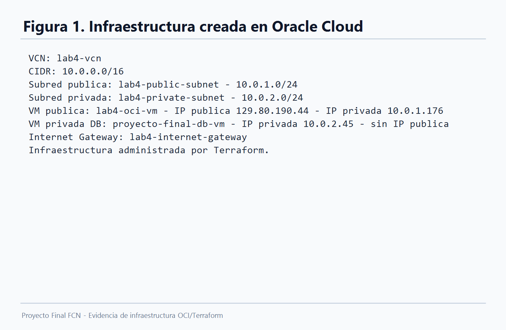

La figura muestra los componentes principales del proyecto: la VCN `lab4-vcn`, las subredes `10.0.1.0/24` y `10.0.2.0/24`, la VM pública `lab4-oci-vm` y la VM privada `proyecto-final-db-vm`. Esta evidencia es importante porque resume la relación entre los recursos creados y confirma la separación entre la capa pública de aplicación y la capa privada de base de datos.

### Infraestructura Terraform

La infraestructura fue construida con Terraform. Esta decisión permitió definir los recursos como código, mantener una configuración reproducible y verificar que los elementos desplegados en OCI coincidieran con la configuración local.

Antes de ejecutar el despliegue, se configuró el proveedor de OCI y las variables necesarias para autenticar Terraform contra la cuenta de Oracle Cloud. La configuración incluyó región, tenancy, usuario, fingerprint, ruta de llave privada y compartment donde se crearían los recursos.

**Figura 3.**
Configuración del proveedor y variables de OCI.

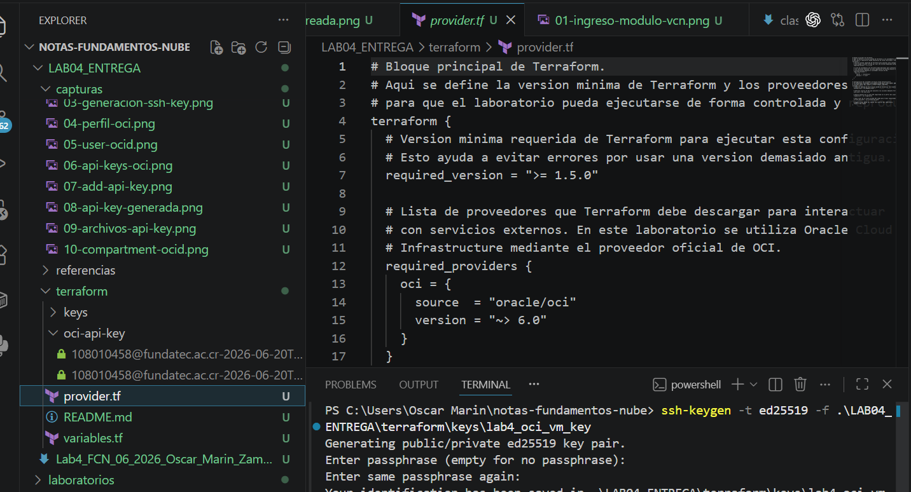

La figura muestra el archivo `provider.tf`, donde se declara la versión mínima de Terraform y el proveedor oficial `oracle/oci`. Esta captura valida que el proyecto fue preparado para interactuar con Oracle Cloud Infrastructure mediante Terraform y que el despliegue no dependió de creación manual de recursos desde la consola.

La definición de red se concentró en `network.tf`. En este archivo se declararon la VCN, el Internet Gateway, el NAT Gateway, las tablas de rutas, las listas de seguridad y las subredes utilizadas por la arquitectura.

**Figura 4.**
Definición de red en Terraform.

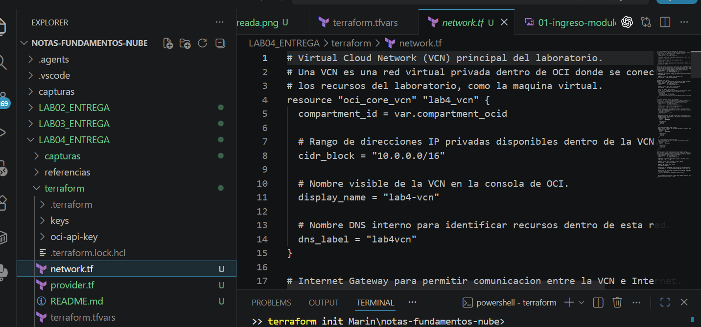

La figura evidencia el archivo `network.tf`, donde inicia la definición de la VCN `lab4-vcn` y su bloque CIDR `10.0.0.0/16`. Esta captura es relevante porque muestra que la red principal fue descrita como código y que los recursos de conectividad forman parte de la configuración administrada por Terraform.

La capa de cómputo se definió en archivos Terraform separados. La VM pública se creó para ejecutar la aplicación Flask y la VM privada se agregó para alojar MariaDB dentro de la subred privada.

**Figura 5.**
Definición de cómputo en Terraform.

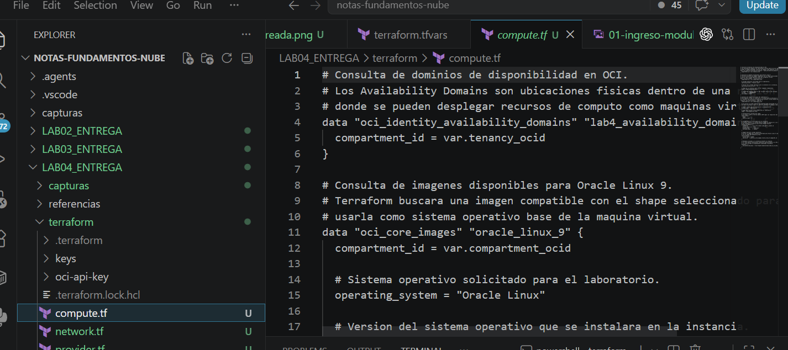

La figura muestra el archivo `compute.tf`, donde se consultan dominios de disponibilidad e imágenes de Oracle Linux 9 para crear instancias compatibles con el entorno. Esta evidencia valida que las máquinas virtuales fueron parametrizadas desde Terraform y que el sistema operativo base fue seleccionado como parte del código de infraestructura.

Terraform también definió salidas para documentar información operativa del despliegue, como nombres de máquinas virtuales, direcciones IP y datos de red. Estas salidas facilitaron la validación posterior.

**Figura 6.**
Salidas configuradas en Terraform.

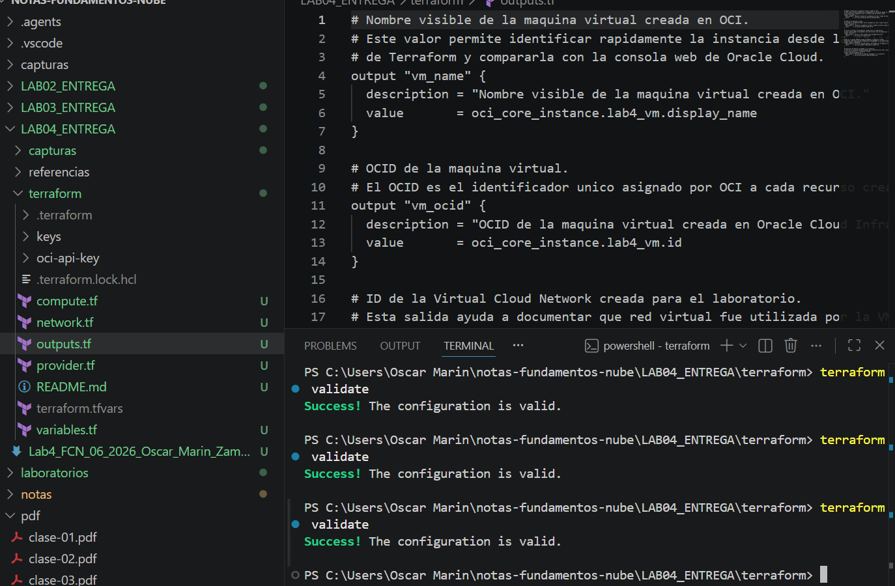

La figura presenta el archivo `outputs.tf`, donde se declaran valores que Terraform imprime al finalizar la ejecución. Esta captura es importante porque muestra cómo se documentaron datos clave de la infraestructura, como la VM, la VCN y las direcciones necesarias para conectividad y pruebas.

Con la configuración lista, se inicializó el directorio de trabajo de Terraform. Este paso descargó y preparó el proveedor necesario para comunicarse con OCI.

**Figura 7.**
Inicialización de Terraform.

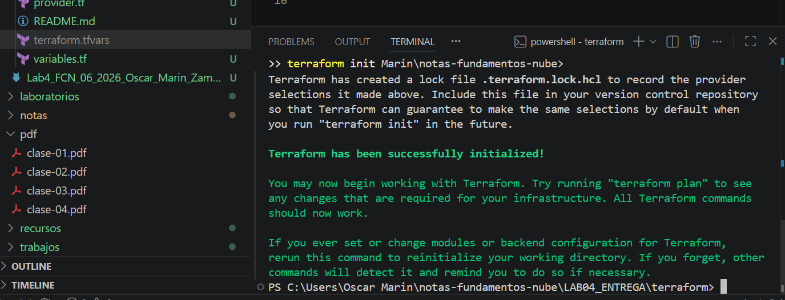

La figura muestra el resultado exitoso de `terraform init`. Esta evidencia valida que Terraform pudo preparar el entorno local, crear el archivo de bloqueo del proveedor y dejar el proyecto listo para ejecutar validaciones, planes y despliegues.

Después de inicializar, se validó la configuración. La validación confirmó que los archivos Terraform estaban correctamente escritos y podían ser interpretados por la herramienta.

**Figura 8.**
Validación de la configuración Terraform.

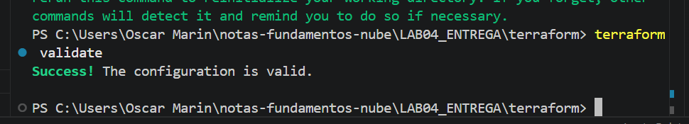

La figura muestra el resultado `Success! The configuration is valid.` Esta captura demuestra que la sintaxis y estructura de la configuración eran válidas antes de aplicar cambios sobre OCI, reduciendo el riesgo de errores durante el despliegue.

Luego se revisó el plan de ejecución. Esta etapa permitió observar qué cambios Terraform iba a aplicar antes de crear o modificar recursos.

**Figura 9.**
Plan de ejecución de Terraform.

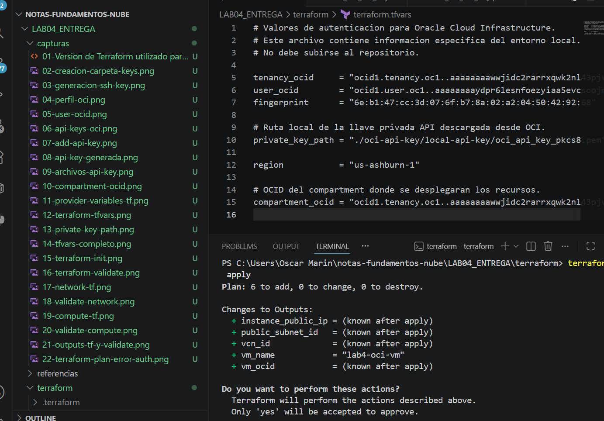

La figura muestra una ejecución de `terraform apply` con el resumen del plan antes de confirmar los cambios. Esta evidencia valida que Terraform identificó recursos por crear y presentó las salidas esperadas, permitiendo revisar la operación antes de aprobarla.

Una vez revisado el plan, se aplicó la infraestructura. El resultado confirmó que los recursos definidos fueron creados correctamente.

**Figura 10.**
Aplicación completa de Terraform.

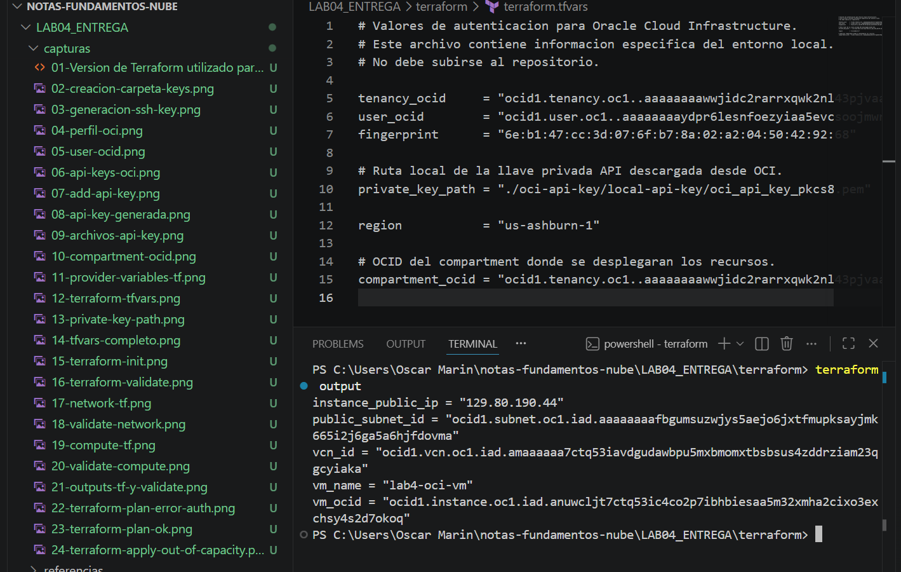

La figura muestra la finalización del proceso de aplicación y las salidas generadas por Terraform. Esta captura valida que la infraestructura fue creada desde código y que Terraform devolvió información útil para identificar la VM pública, la subred y la VCN resultantes.

**Figura 11.**
Confirmación del despliegue de infraestructura.

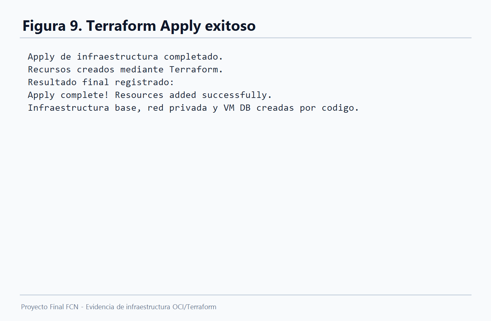

La figura resume el resultado del `terraform apply`, indicando que la infraestructura base, la red privada y la VM de base de datos fueron creadas por código. Esta evidencia es relevante porque confirma el cierre exitoso del despliegue de los componentes principales del proyecto.

Después del despliegue, se ejecutó nuevamente `terraform plan` para verificar si existían diferencias entre el código y la infraestructura real.

**Figura 12.**
Terraform plan sin diferencias.

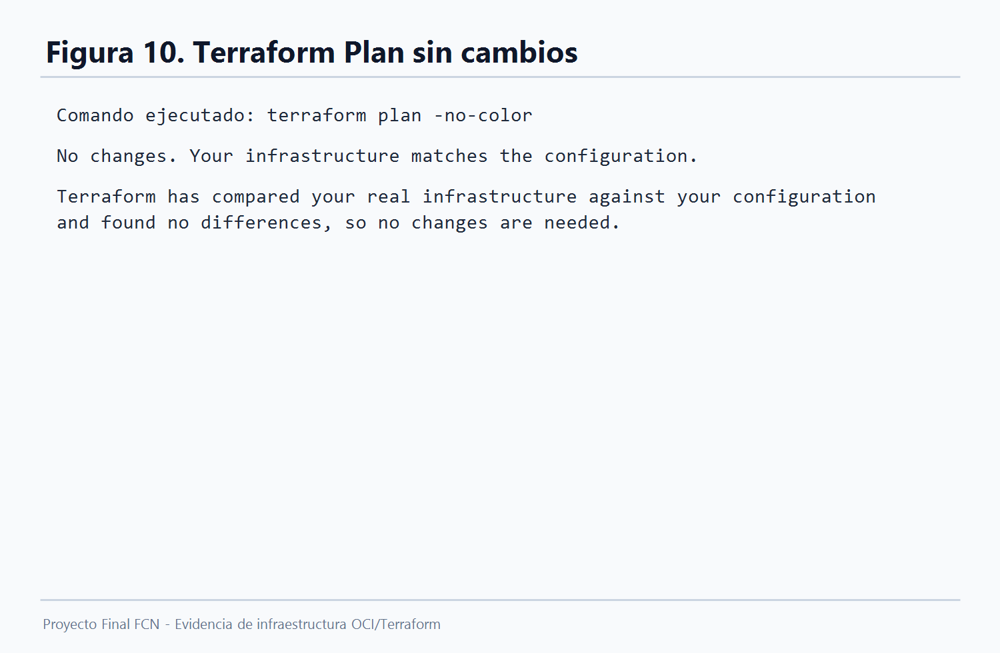

La figura muestra el mensaje `No changes. Your infrastructure matches the configuration.` Esta evidencia valida que la infraestructura desplegada en OCI coincide con el estado esperado por Terraform y que el código refleja correctamente los recursos creados en la nube.

También se revisó el estado de Terraform para confirmar que los recursos principales estaban bajo administración de la herramienta.

**Figura 13.**
Recursos registrados en Terraform State.

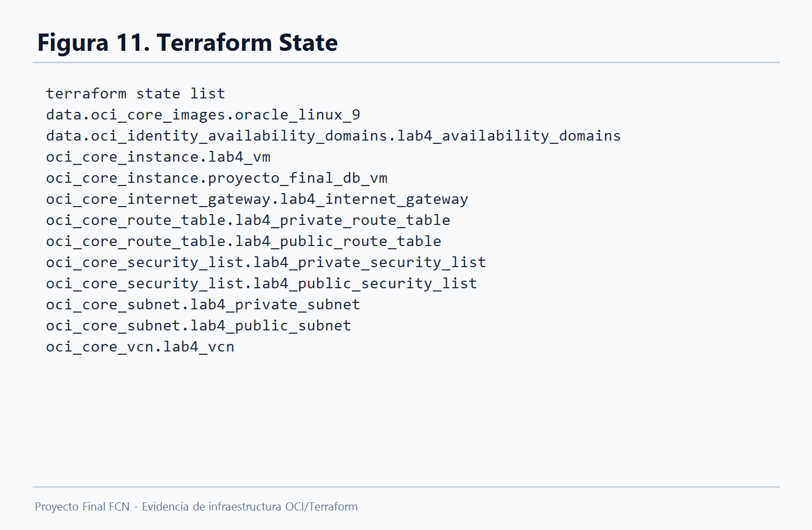

La figura muestra la lista de recursos administrados en el estado de Terraform, incluyendo instancias, subredes, VCN, tablas de rutas y listas de seguridad. Esta evidencia es importante porque confirma que Terraform mantiene trazabilidad sobre los recursos reales creados en OCI.

Finalmente, se consultaron las salidas finales del proyecto, donde se observan direcciones y nombres usados durante las pruebas.

**Figura 14.**
Salidas finales de Terraform.

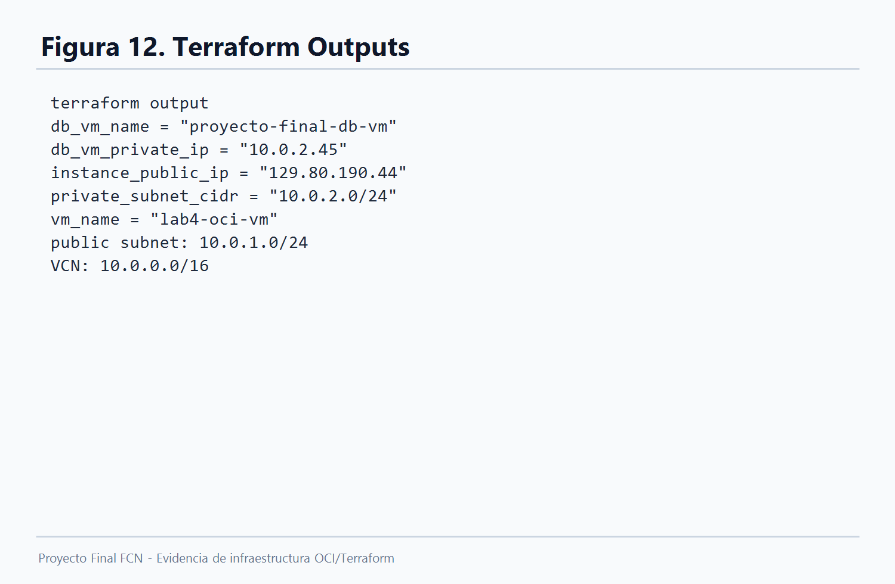

La figura muestra valores como la IP pública `129.80.190.44`, la IP privada de base de datos `10.0.2.45`, el nombre `lab4-oci-vm`, el nombre `proyecto-final-db-vm` y los bloques de red. Esta captura valida la información operativa utilizada para acceder a la aplicación y probar la comunicación privada.

### Configuración de red

La red principal del proyecto fue una VCN con bloque `10.0.0.0/16`. Esta red funcionó como contenedor lógico para las subredes, las rutas, las reglas de seguridad y las máquinas virtuales.

### VCN

**Figura 15.**
VCN principal del proyecto.

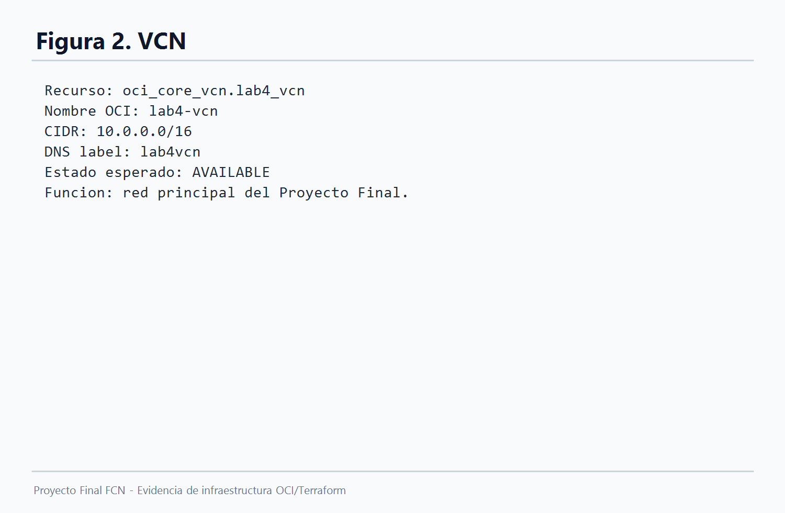

La figura muestra la VCN `lab4-vcn`, su bloque CIDR `10.0.0.0/16`, el DNS label `lab4vcn` y el estado esperado `AVAILABLE`. Esta evidencia valida la existencia de la red principal donde se conectan los recursos del proyecto y confirma que la arquitectura quedó agrupada dentro de una red privada de OCI.

### Subred pública

La subred pública se creó con el bloque `10.0.1.0/24`. Su función fue alojar la VM de aplicación y permitir que esta recibiera una dirección IP pública para acceso desde Internet.

**Figura 16.**
Subred pública para la aplicación.

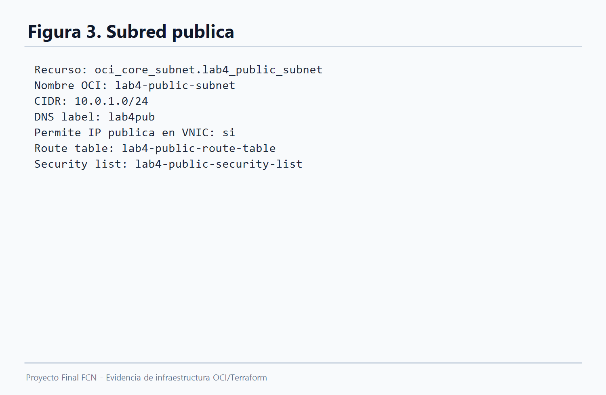

La figura muestra la subred `lab4-public-subnet`, su CIDR `10.0.1.0/24`, la tabla de rutas pública y la lista de seguridad pública asociada. Esta captura valida que la capa de aplicación fue ubicada en una subred capaz de asignar IP pública, condición necesaria para exponer la aplicación Flask al navegador.

### Subred privada

La subred privada se creó con el bloque `10.0.2.0/24`. Su propósito fue alojar la VM de base de datos sin permitir asignación de IP pública.

**Figura 17.**
Subred privada para MariaDB.

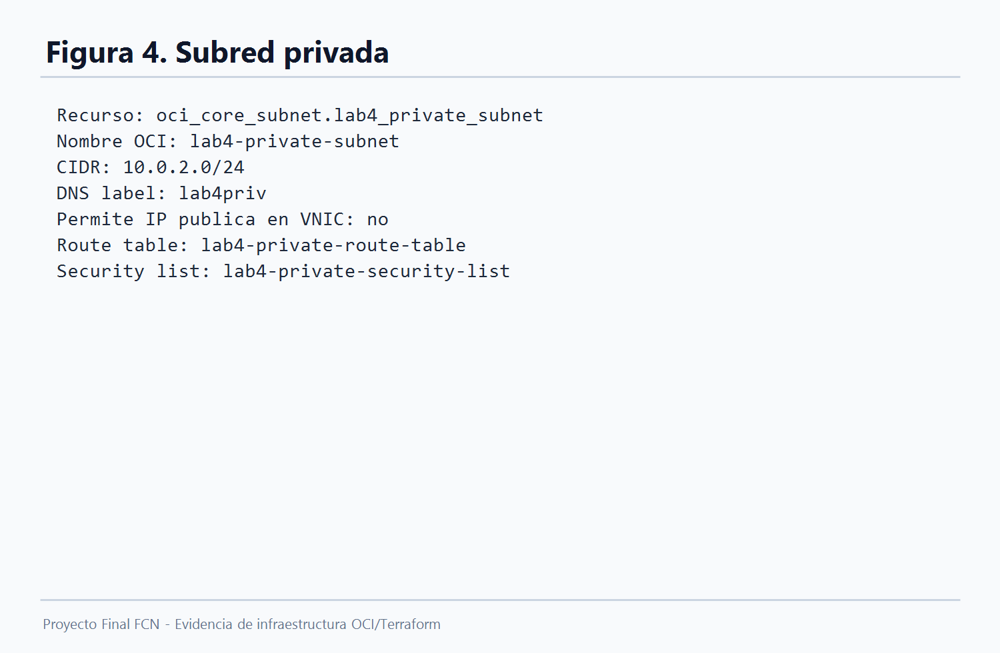

La figura muestra la subred `lab4-private-subnet`, su CIDR `10.0.2.0/24` y la configuración que impide asignar IP pública a las VNIC. Esta evidencia valida el aislamiento de la capa de datos y confirma que la base de datos no queda expuesta directamente a Internet.

### Internet Gateway

La subred pública utiliza una ruta por defecto hacia el Internet Gateway para permitir el tráfico externo requerido por la VM pública.

### NAT Gateway

La subred privada se mantiene sin ruta directa hacia el Internet Gateway, lo que evita conexiones entrantes desde Internet hacia la base de datos. En Terraform también se definió un NAT Gateway para permitir salida controlada desde la subred privada cuando fuera necesario instalar o actualizar paquetes, sin convertirla en una subred pública.

El NAT Gateway cumple una función específica dentro del diseño: permite tráfico saliente desde recursos privados cuando requieren actualizaciones o instalación de paquetes, pero no habilita conexiones entrantes hacia MariaDB. Esto mantiene el aislamiento de la base de datos y evita exponer la VM privada al tráfico público.

### Route Tables

**Figura 18.**
Tablas de rutas de la arquitectura.

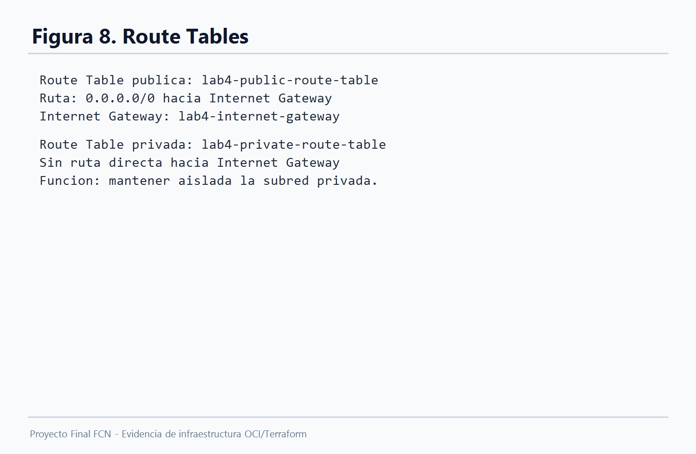

La figura muestra la tabla pública `lab4-public-route-table` con salida `0.0.0.0/0` hacia el Internet Gateway y la tabla privada `lab4-private-route-table` sin salida directa hacia el Internet Gateway. Esta evidencia es clave para validar la separación de tráfico: la VM pública puede recibir conexiones externas, mientras que la VM privada permanece protegida dentro de la red.

### Security Lists

Las listas de seguridad definen qué tráfico puede entrar y salir de cada subred. En la subred pública se permitieron SSH, HTTP y HTTPS desde Internet. En la subred privada se permitió ICMP interno, SSH desde la subred pública y MariaDB por el puerto `3306` desde `10.0.1.0/24`.

**Figura 19.**
Reglas de seguridad públicas y privadas.

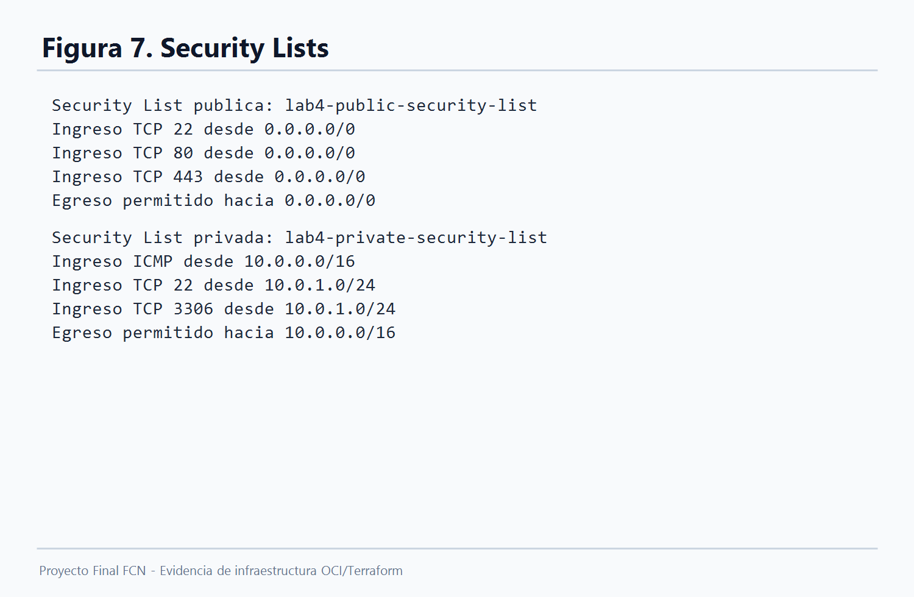

La figura muestra las reglas de ingreso y egreso aplicadas a las subredes pública y privada. Esta evidencia valida que la aplicación puede ser accedida por HTTP y administrada por SSH, mientras que MariaDB queda limitado al tráfico interno proveniente de la subred pública.

### VM pública

La VM pública `lab4-oci-vm` fue desplegada en la subred pública con Oracle Linux 9 y shape `VM.Standard.E2.1.Micro`. Esta instancia funciona como punto de entrada del proyecto, ya que aloja la aplicación Flask y permite administración remota mediante SSH.

**Figura 20.**
Instancia pública desplegada en OCI.

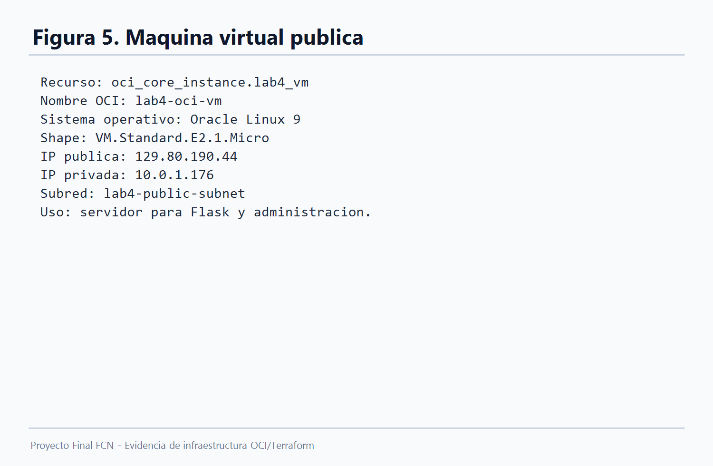

La figura muestra la VM pública `lab4-oci-vm`, su sistema operativo, shape, IP pública `129.80.190.44`, IP privada `10.0.1.176` y subred asociada. Esta captura valida que la capa de aplicación quedó desplegada en la subred correcta y dispone de una dirección pública para recibir solicitudes desde el navegador.

La conectividad administrativa hacia esta instancia fue validada mediante SSH usando el usuario `opc`.

**Figura 21.**
Acceso SSH a la VM pública.

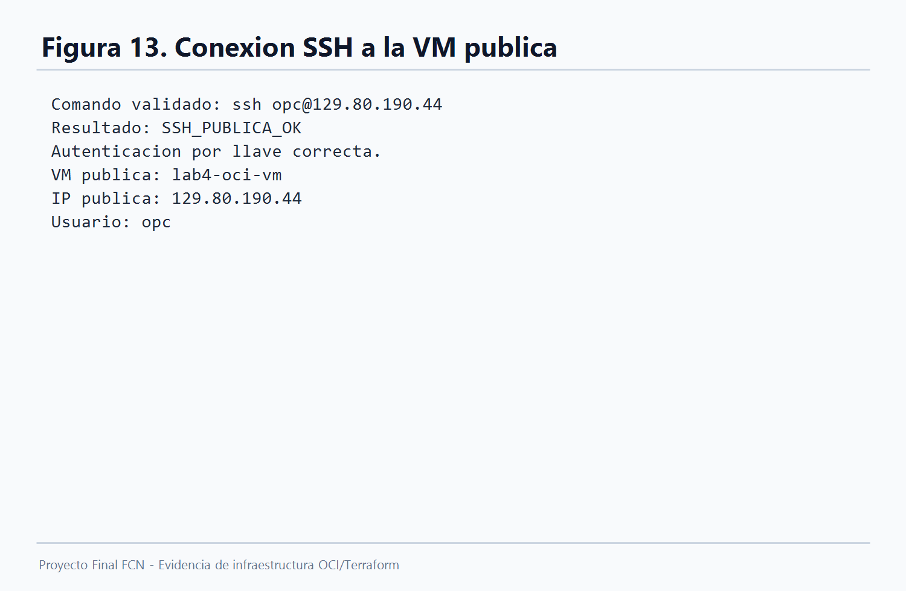

La figura muestra la prueba de conexión `ssh opc@129.80.190.44` con resultado `SSH_PUBLICA_OK`. Esta evidencia valida que la VM pública responde desde Internet por el puerto SSH permitido y que la autenticación por llave quedó funcionando correctamente.

### VM privada

La VM privada `proyecto-final-db-vm` fue desplegada en la subred privada con Oracle Linux 9 y shape `VM.Standard.E2.1.Micro`. Esta instancia no posee IP pública y fue destinada a alojar MariaDB.

**Figura 22.**
Instancia privada para base de datos.

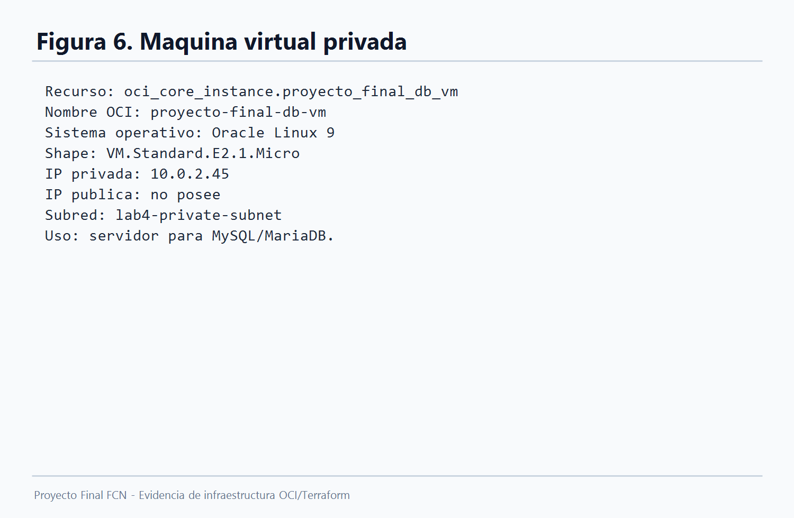

La figura muestra la VM privada `proyecto-final-db-vm`, su IP privada `10.0.2.45`, la ausencia de IP pública y su asociación con `lab4-private-subnet`. Esta evidencia valida que la base de datos fue ubicada en una capa privada, coherente con el objetivo de no exponer MariaDB directamente a Internet.

La comunicación entre la VM pública y la VM privada se validó primero mediante conectividad ICMP hacia la IP privada de la base de datos.

**Figura 23.**
Comunicación privada entre VM pública y VM privada.

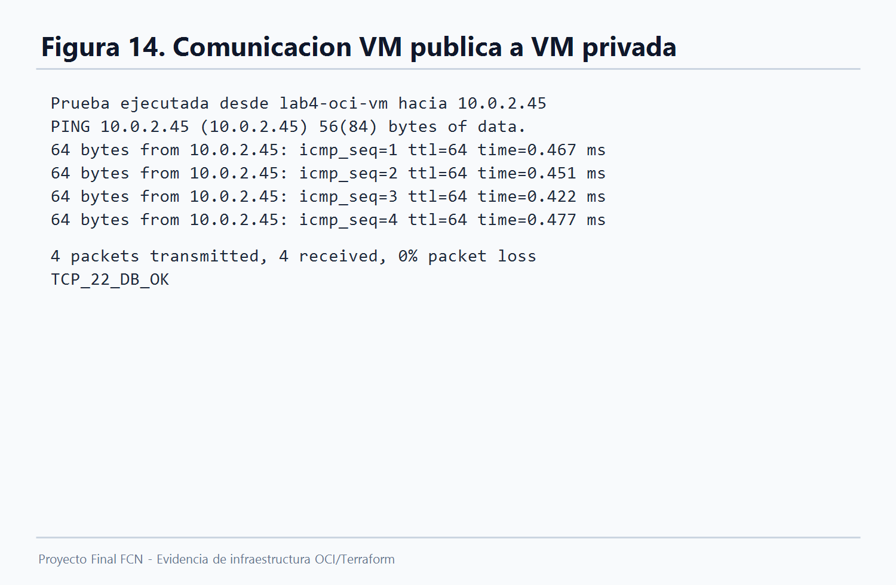

La figura muestra una prueba `ping` desde `lab4-oci-vm` hacia `10.0.2.45` con cuatro paquetes transmitidos y cuatro recibidos. Esta evidencia valida que ambas instancias pueden comunicarse dentro de la VCN y que la ruta interna entre subred pública y subred privada funciona correctamente.

También se validó el acceso SSH interno hacia la VM privada utilizando la VM pública como punto de salto.

**Figura 24.**
Acceso interno a la VM privada.

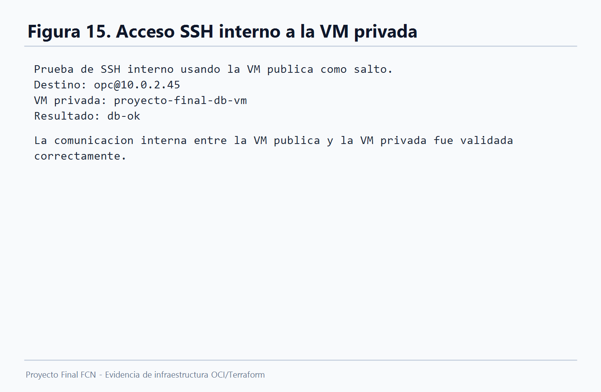

La figura muestra una conexión interna hacia `opc@10.0.2.45` con resultado `db-ok`. Esta evidencia confirma que la administración de la VM privada se realiza desde la red interna y no desde Internet, lo cual refuerza el diseño de seguridad de la solución.

### MariaDB

MariaDB fue instalado y configurado en la VM privada `proyecto-final-db-vm`, ubicada en la subred privada `lab4-private-subnet` con la dirección `10.0.2.45`. Esta decisión mantiene la base de datos fuera del acceso directo desde Internet y permite que únicamente la capa de aplicación se comunique con ella mediante la red interna de OCI.

Durante la configuración de la VM privada se recuperó el acceso operativo a la instancia y se atendió un problema de memoria que afectaba la estabilidad del servidor. Para corregirlo se implementó swap, lo que permitió disponer de memoria auxiliar y completar la instalación de MariaDB con mayor estabilidad. Después de esta recuperación, el servicio de base de datos quedó preparado para iniciar y recibir conexiones internas desde la VM pública.

La Figura 22 muestra la VM `proyecto-final-db-vm` con IP privada `10.0.2.45` y sin IP pública. Esta evidencia respalda la ubicación privada de MariaDB dentro de la arquitectura y valida que la base de datos se ejecuta en una instancia separada de la aplicación web.

Una vez instalado MariaDB, se creó la base de datos `proyecto_final`, el usuario de aplicación `flaskuser` y la tabla `usuarios`. Esta tabla almacena los registros enviados desde el formulario web. La aplicación Flask utiliza PyMySQL para autenticarse con `flaskuser`, conectarse a MariaDB mediante `10.0.2.45` y ejecutar operaciones de inserción y consulta sobre `usuarios`.

La comunicación privada entre la VM pública y la VM de base de datos fue validada antes de conectar la aplicación. Primero se comprobó conectividad de red hacia `10.0.2.45`; luego se confirmó el acceso interno a la VM privada usando la VM pública como punto de salto.

La Figura 23 muestra respuesta correcta desde `10.0.2.45` con pérdida de paquetes del `0%`. Esta evidencia valida que la VM pública puede alcanzar la VM privada dentro de la VCN, condición necesaria para que Flask pueda conectarse a MariaDB sin exponer la base de datos a Internet.

La Figura 24 muestra la validación `db-ok` al acceder internamente a la VM privada. Esta evidencia confirma que la administración y operación del servidor de base de datos se realizan por la red interna del proyecto, manteniendo el aislamiento de la capa de datos.

### Aplicación Flask

La aplicación web fue implementada en Python utilizando Flask como framework web y PyMySQL como conector hacia MariaDB. Se desplegó en la VM pública `lab4-oci-vm`, la cual recibe las solicitudes HTTP desde el navegador y funciona como punto de entrada de la solución.

```text
http://129.80.190.44/
```

La interfaz incluye un formulario HTML con un campo para ingresar nombres y un botón `Guardar`. Cuando el usuario envía el formulario, Flask recibe la solicitud `POST`, procesa el dato ingresado y utiliza PyMySQL para abrir una conexión privada hacia MariaDB en `10.0.2.45`. Después de insertar el registro en la tabla `usuarios`, la aplicación ejecuta una consulta para recuperar los registros actuales y responde al navegador con el listado actualizado.

Este flujo permite que el usuario interactúe únicamente con la aplicación pública, mientras que la persistencia ocurre en la base de datos privada. La base de datos no se publica en Internet; la comunicación entre Flask y MariaDB se realiza dentro de la red de OCI.

**Figura 25.**
Aplicación Flask conectada a MariaDB.


La figura muestra la aplicación web `Usuarios` cargada en el navegador, el formulario HTML con el campo `Nombre`, el botón `Guardar` y una tabla con registros almacenados. Esta evidencia valida que Flask está funcionando, que la interfaz está disponible para el usuario y que la aplicación consulta información persistida en MariaDB para construir la respuesta mostrada en el navegador.

### Pruebas funcionales

Las pruebas funcionales validaron el recorrido completo de la solución: acceso a la aplicación, uso del formulario, procesamiento del registro, persistencia en MariaDB, consulta de datos y conectividad privada entre la VM pública y la VM de base de datos.

#### Prueba 1. Acceso a la aplicación

Se accedió a `http://129.80.190.44/` desde el navegador. La carga de la pantalla `Usuarios` confirma que la VM pública acepta tráfico HTTP y que el servicio Flask responde correctamente.

Figura correspondiente: Figura 25.

La figura valida que la aplicación se encuentra publicada desde la VM pública y que el navegador puede consumir el servicio web desplegado en Flask.

#### Prueba 2. Formulario web

Se verificó que la página mostrara el campo `Nombre` y el botón `Guardar`. Esta prueba confirma que la interfaz HTML permite capturar información del usuario y enviarla al backend Flask.

Figura correspondiente: Figura 25.

La figura muestra el formulario disponible en la aplicación. Este elemento es el punto de entrada del flujo funcional de inserción hacia MariaDB.

#### Prueba 3. Inserción de datos

Se ingresó un nombre desde el formulario para validar que la aplicación recibiera datos mediante una solicitud `POST`. Flask procesa el valor enviado y prepara la inserción correspondiente en la tabla `usuarios`.

Figura correspondiente: Figura 25.

La figura respalda el formulario utilizado para realizar la entrada de datos. La presencia del campo `Nombre` y el botón `Guardar` confirma el mecanismo utilizado para iniciar la operación.

#### Prueba 4. Confirmación del almacenamiento

Después de enviar el formulario, la aplicación confirma el guardado del nombre y recarga la vista con la información actualizada. Esta prueba valida que Flask completó el procesamiento del `POST` y ejecutó la operación de almacenamiento.

Figura correspondiente: Figura 25.

La figura muestra la aplicación ya cargada con el listado de usuarios, lo que respalda el resultado posterior al procesamiento de registros dentro del flujo web.

#### Prueba 5. Consulta de registros

La tabla visible en la aplicación presenta registros almacenados en MariaDB, incluyendo `Grupo Nati Ema y Oscar`. Esta prueba valida que la aplicación consulta la tabla `usuarios` después de la operación y muestra los datos persistidos al usuario.

Figura correspondiente: Figura 25.

La figura evidencia el listado de usuarios recuperado desde la base de datos. Esto confirma que la capa web no solo recibe datos, sino que también consulta MariaDB y presenta la información almacenada.

**Consulta SQL**

La persistencia de registros se validó mediante la consulta sobre la tabla `usuarios`, equivalente al flujo de lectura que ejecuta Flask para construir la tabla mostrada en pantalla.

```sql
SELECT * FROM usuarios;
```

Figura correspondiente: Figura 25.

La tabla mostrada por la aplicación representa el resultado funcional de consultar los registros almacenados en MariaDB. Esta evidencia valida que los datos existen en la base y que pueden ser recuperados por la aplicación.

#### Prueba 6. Conectividad privada

Se validó la comunicación desde la VM pública hacia la VM privada usando la IP `10.0.2.45`. Esta prueba confirma que la aplicación Flask puede alcanzar el servidor MariaDB por la red privada de OCI.

Figura correspondiente: Figura 23.

La figura muestra comunicación exitosa hacia `10.0.2.45` con `0%` de pérdida. Esta evidencia valida la ruta interna utilizada por Flask para conectarse a MariaDB sin exponer el servidor de base de datos a Internet.

### Resultados

La infraestructura quedó desplegada mediante Terraform y validada con `terraform validate`, `terraform apply`, `terraform plan`, `terraform state list` y `terraform output`. Las evidencias muestran que la VCN, las subredes, las listas de seguridad, las tablas de rutas y las máquinas virtuales fueron administradas como recursos de Terraform. Con esto se cumple el objetivo de implementar la infraestructura como código y mantener trazabilidad entre la configuración local y los recursos reales en OCI.

La VM pública quedó disponible con la IP `129.80.190.44` y aloja la aplicación Flask. La VM privada quedó disponible únicamente con la IP `10.0.2.45`, sin dirección pública, y ejecuta MariaDB como servicio de base de datos del proyecto. Esta separación responde al objetivo de publicar la capa web sin exponer la capa de datos.

La aplicación Flask quedó funcionando desde navegador y presentó un formulario operativo para registrar nombres. El formulario permite enviar datos mediante `POST`, insertar registros en la tabla `usuarios` y consultar nuevamente la información almacenada para mostrar el listado actualizado. Este resultado valida la integración entre Python, Flask, PyMySQL y MariaDB.

La inserción fue validada mediante el flujo de la aplicación y la consulta de registros fue validada mediante la tabla visible en la interfaz. MariaDB quedó funcionando en la VM privada y Flask quedó funcionando en la VM pública, manteniendo la separación entre capa web y capa de datos. La tabla de usuarios confirma que la aplicación recupera información persistida y responde al navegador con contenido generado a partir de la base de datos.

La comunicación privada entre Flask y MariaDB quedó validada mediante la conectividad desde la VM pública hacia `10.0.2.45`. Con esto se confirma que la arquitectura cumple el objetivo principal del proyecto: exponer únicamente la aplicación web y conservar la base de datos dentro de la red privada de OCI. Las reglas de seguridad, las tablas de rutas y la ausencia de IP pública en la VM de base de datos fortalecen el diseño de seguridad implementado.

### Conclusiones

Terraform permitió implementar la infraestructura de forma controlada y verificable, manteniendo una relación directa entre el código y los recursos desplegados en OCI. Este enfoque facilitó validar el estado final de la VCN, subredes, rutas, listas de seguridad e instancias de cómputo.

La separación entre subred pública y subred privada permitió construir una arquitectura más segura, donde la aplicación está disponible para el usuario y la base de datos permanece sin exposición pública. Esta división entre capas reduce el riesgo de acceso directo a MariaDB desde Internet.

Las tablas de rutas, el NAT Gateway y las Security Lists fueron determinantes para controlar el tráfico permitido. La VM pública recibe el tráfico necesario para administración y acceso web, mientras que la VM privada conserva salida controlada para operaciones del sistema y restringe las conexiones entrantes a la red interna del proyecto.

La validación de conectividad entre la VM pública y la VM privada confirmó que la comunicación interna de OCI funciona correctamente para soportar una aplicación web conectada a una base de datos privada. Esta prueba fue esencial para demostrar que Flask puede comunicarse con MariaDB sin publicar el servidor de base de datos.

La aplicación Flask permitió demostrar el resultado funcional de la arquitectura: una interfaz web pública capaz de recibir solicitudes, procesar datos con Python, conectarse mediante PyMySQL y mostrar registros almacenados en MariaDB.

El proyecto permitió integrar infraestructura como código, redes privadas, seguridad de acceso, base de datos y aplicación web en un flujo completo. El aprendizaje principal fue comprobar cómo una arquitectura sencilla de dos capas puede mejorar la seguridad al separar el punto de acceso público de la persistencia de datos.
